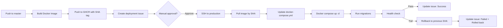

# Phase 5: Automated Deployments

**Status:** 📋 Ready to Implement  
**Feature:** LR002 - CI/CD Pipeline  
**Prerequisites:** Phase 4 (Docker Build Automation) ✅ Complete  
**Last Updated:** 2025-11-08

> **💡 Resume here:** Start with Phase 5.1 (Deploy Script Enhancement) when ready to implement.

## Overview

Convert deployment placeholder workflows to real automated deployments that pull pre-built Docker images from GHCR and deploy them to staging and production environments.

## Current Progress

**What's Done:** ✅
- Docker images automatically built and pushed to GHCR (Phase 4)
- Production server running with manual deployments
- Deploy script exists at `deploy/bin/deploy`
- Planning and documentation complete

**What's Next:** 🔲
- **Phase 5.1:** Enhance deploy script to accept SHA tags
- **Phase 5.2:** Create GitHub Actions deployment workflow
- **Phase 5.3:** Create rollback workflow
- **Phase 5.4:** (Optional) Auto-deploy on version tags
- **Phase 5.5:** Documentation and training

**Status:** All prerequisites met, ready to implement!

## Current State (Phase 4 Complete)

### What's Working ✅

1. **Docker images automatically built** on every push to `master` and version tags
2. **Images pushed to GHCR** with semantic tags:
   - `master` - Latest master branch
   - `sha-{commit}` - Specific commit (immutable)
   - `v{version}` - Version releases (immutable)
   - `latest` - Latest version release (mutable)
3. **Deployment placeholder issues created** with image metadata
4. **Build cache optimized** for faster builds

### What's Manual ⚠️

1. **Production deployment** - Manual `docker pull` and restart
2. **Currently using `master` tag** - Should migrate to SHA-based tags
3. **No staging environment** - Only production exists
4. **No automated health checks** - Manual verification
5. **No rollback automation** - Manual image tag changes

## Goals

### Primary Goal
Automate deployment to production using pre-built Docker images from GHCR with SHA-based tags for immutability and easy rollback.

### Secondary Goals
1. Implement health check verification after deployment
2. Enable easy rollback to previous deployments
3. Track deployment history and metadata
4. Provide deployment status in GitHub issues

## Benefits

### Automation Benefits
- **Faster deployments** - No manual SSH and docker commands
- **Consistent process** - Same deployment steps every time
- **Audit trail** - Complete history of what was deployed when
- **Easy rollback** - Redeploy any previous SHA with one command

### Safety Benefits
- **Immutable tags** - SHA-based tags never change
- **Health checks** - Automated verification of successful deployment
- **Deployment records** - GitHub issues track every deployment
- **Explicit deployments** - Know exactly what version is running

## Deployment Strategy

### Production Deployment Flow



### Tagging Strategy

#### For Master Branch Commits
- Build and push with tags: `master`, `sha-{commit}`
- **Deployment:** Manual approval required
- **Target:** Production (after testing)

#### For Version Tags
- Build and push with tags: `v{version}`, `latest`, `sha-{commit}`
- **Deployment:** Manual approval required
- **Target:** Production releases

### SHA-Based Deployment Model

**Why SHA tags?**
1. **Immutable** - `sha-f4f81f5` will always be the same image
2. **Reproducible** - Can redeploy exact same version
3. **Rollback-friendly** - Just deploy a different SHA
4. **Explicit** - No ambiguity about what's running

**Deployment metadata tracking:**
```bash
# On production server: /app/DEPLOYED_VERSION
sha-f4f81f5
deployed_at=2025-11-08T23:15:00Z
deployed_by=github-actions
previous_sha=sha-abc1234
```

## Implementation Plan

### Phase 5.1: Deploy Script Enhancement

**File:** `deploy/bin/deploy`

**Current capabilities:**
- Deploys to production or staging
- Handles environment-specific configuration
- Runs database migrations
- Manages Docker containers

**Enhancements needed:**

1. **Accept image tag parameter**
   ```bash
   ./deploy/bin/deploy --image-tag=sha-f4f81f5
   ```

2. **Pull specific image from GHCR**
   ```bash
   docker pull ghcr.io/steveclarke/lr-backend:${IMAGE_TAG}
   ```

3. **Update docker-compose.yml with specific tag**
   ```bash
   # Replace image tag in docker-compose.yml
   sed -i "s|image: ghcr.io/steveclarke/lr-backend:.*|image: ghcr.io/steveclarke/lr-backend:${IMAGE_TAG}|" docker-compose.yml
   ```

4. **Record deployment metadata**
   ```bash
   # Save what was deployed
   cat > DEPLOYED_VERSION <<EOF
   ${IMAGE_TAG}
   deployed_at=$(date -u +%Y-%m-%dT%H:%M:%SZ)
   deployed_by=${DEPLOYED_BY:-manual}
   previous_sha=$(cat DEPLOYED_VERSION 2>/dev/null | head -1 || echo "none")
   EOF
   ```

5. **Health check verification**
   ```bash
   # Wait for app to be healthy
   for i in {1..30}; do
     if curl -f http://localhost:3000/up; then
       echo "✅ Deployment successful"
       exit 0
     fi
     sleep 10
   done
   echo "❌ Health check failed"
   exit 1
   ```

### Phase 5.2: GitHub Actions Deployment Workflow

**File:** `.github/workflows/deploy-production.yml`

**Workflow structure:**

```yaml
name: Deploy to Production

on:
  workflow_dispatch:
    inputs:
      image_tag:
        description: 'Image tag to deploy (e.g., sha-f4f81f5)'
        required: true
        type: string

jobs:
  deploy:
    name: Deploy to production
    runs-on: ubuntu-latest
    environment:
      name: production
      url: https://linkradar.app
    
    steps:
      - name: Checkout repository
        uses: actions/checkout@v5
      
      - name: Verify image exists in GHCR
        run: |
          docker pull ghcr.io/steveclarke/lr-backend:${{ inputs.image_tag }}
      
      - name: Setup SSH
        uses: webfactory/ssh-agent@v0.9.0
        with:
          ssh-private-key: ${{ secrets.PRODUCTION_DEPLOY_KEY }}
      
      - name: Deploy to production
        run: |
          ssh deploy@${{ secrets.PRODUCTION_HOST }} \
            "cd /app && ./deploy/bin/deploy --image-tag=${{ inputs.image_tag }}"
      
      - name: Create deployment record
        uses: actions/github-script@v7
        if: always()
        with:
          script: |
            const deploymentStatus = '${{ job.status }}' === 'success' ? 'success' : 'failure';
            const imageTag = '${{ inputs.image_tag }}';
            
            await github.rest.issues.create({
              owner: context.repo.owner,
              repo: context.repo.repo,
              title: `[Production] Deploy ${imageTag} - ${deploymentStatus}`,
              labels: ['deployment: production', `deployment-${deploymentStatus}`],
              body: `## 🚀 Production Deployment ${deploymentStatus === 'success' ? 'Successful' : 'Failed'}
              
              **Image:** \`ghcr.io/steveclarke/lr-backend:${imageTag}\`
              **Status:** ${deploymentStatus}
              **Deployed at:** ${new Date().toISOString()}
              **Deployed by:** @${context.actor}
              
              ### Deployment Details
              - **Workflow run:** [#${context.runNumber}](${context.serverUrl}/${context.repo.owner}/${context.repo.repo}/actions/runs/${context.runId})
              - **Commit:** [\`${imageTag.replace('sha-', '')}\`](${context.serverUrl}/${context.repo.owner}/${context.repo.repo}/commit/${imageTag.replace('sha-', '')})
              
              ${deploymentStatus === 'failure' ? '### ⚠️ Deployment Failed\n\nCheck the workflow logs for details. Consider rolling back to the previous version.' : '### ✅ Deployment Successful\n\nThe application has been deployed and health checks passed.'}
              `
            });
```

### Phase 5.3: Rollback Workflow

**File:** `.github/workflows/rollback-production.yml`

```yaml
name: Rollback Production

on:
  workflow_dispatch:
    inputs:
      target_sha:
        description: 'SHA to rollback to (leave empty for previous deployment)'
        required: false
        type: string

jobs:
  rollback:
    name: Rollback production
    runs-on: ubuntu-latest
    environment:
      name: production
      url: https://linkradar.app
    
    steps:
      - name: Determine rollback target
        id: target
        run: |
          if [ -n "${{ inputs.target_sha }}" ]; then
            echo "sha=${{ inputs.target_sha }}" >> $GITHUB_OUTPUT
          else
            # Get previous SHA from production server
            ssh deploy@${{ secrets.PRODUCTION_HOST }} \
              "grep previous_sha /app/DEPLOYED_VERSION | cut -d= -f2"
          fi
      
      - name: Rollback deployment
        uses: ./.github/workflows/deploy-production.yml
        with:
          image_tag: ${{ steps.target.outputs.sha }}
```

### Phase 5.4: Automatic Deployment Trigger (Optional)

**File:** `.github/workflows/auto-deploy-production.yml`

```yaml
name: Auto-Deploy to Production

on:
  push:
    tags:
      - 'v*.*.*'

jobs:
  auto-deploy:
    name: Trigger production deployment
    runs-on: ubuntu-latest
    
    steps:
      - name: Get commit SHA
        id: sha
        run: |
          echo "short=$(git rev-parse --short HEAD)" >> $GITHUB_OUTPUT
      
      - name: Trigger deployment workflow
        uses: actions/github-script@v7
        with:
          script: |
            await github.rest.actions.createWorkflowDispatch({
              owner: context.repo.owner,
              repo: context.repo.repo,
              workflow_id: 'deploy-production.yml',
              ref: 'master',
              inputs: {
                image_tag: `sha-${{ steps.sha.outputs.short }}`
              }
            });
```

## Required Secrets

Add these to GitHub repository secrets:

1. **`PRODUCTION_DEPLOY_KEY`** - SSH private key for deployment user
2. **`PRODUCTION_HOST`** - Production server hostname/IP

### Generating Deploy Key

```bash
# On your local machine
ssh-keygen -t ed25519 -C "github-actions-deploy" -f ~/.ssh/github_deploy_key

# Add public key to production server
ssh-copy-id -i ~/.ssh/github_deploy_key.pub deploy@production-server

# Add private key to GitHub secrets
cat ~/.ssh/github_deploy_key  # Copy this to PRODUCTION_DEPLOY_KEY secret
```

## Deployment Process

### Manual Deployment (Recommended Initially)

1. **Merge to master** → Docker image built automatically
2. **View deployment issue** → Note the SHA tag
3. **Go to Actions** → Deploy to Production workflow
4. **Click "Run workflow"**
5. **Enter SHA tag** (e.g., `sha-f4f81f5`)
6. **Click "Run"**
7. **Monitor deployment** → Check logs and health
8. **Verify success** → Check deployment issue

### Future: Automatic Deployment

1. **Create version tag** → `git tag v1.0.0 && git push origin v1.0.0`
2. **Image built automatically** → Tagged with `v1.0.0`, `latest`, `sha-{commit}`
3. **Deployment triggered automatically** → Deploys SHA tag
4. **Health checks run** → Automatic verification
5. **Issue updated** → Deployment status recorded

## Rollback Process

### Quick Rollback
```bash
# On production server
cd /app
./deploy/bin/deploy --image-tag=sha-abc1234  # Previous working SHA
```

### GitHub Actions Rollback
1. Go to Actions → Rollback Production
2. Enter target SHA or leave empty for previous
3. Click "Run workflow"
4. Monitor rollback process

## Health Checks

### Application Health Endpoint

**Current:** `GET /up` (Rails default)

**Future enhancements:**
```ruby
# app/controllers/health_controller.rb
class HealthController < ApplicationController
  def show
    checks = {
      database: database_check,
      redis: redis_check,
      storage: storage_check
    }
    
    if checks.values.all?
      render json: { status: 'healthy', checks: checks }, status: :ok
    else
      render json: { status: 'unhealthy', checks: checks }, status: :service_unavailable
    end
  end
  
  private
  
  def database_check
    ActiveRecord::Base.connection.execute('SELECT 1')
    true
  rescue
    false
  end
  
  def redis_check
    Redis.current.ping == 'PONG'
  rescue
    false
  end
  
  def storage_check
    ActiveStorage::Blob.service.exist?('health_check')
  rescue
    false
  end
end
```

## Testing Strategy

### Phase 5.1: Manual Testing
1. Test deploy script with SHA tags locally
2. Verify image pulling works
3. Test health checks
4. Test rollback procedure

### Phase 5.2: Staging Environment (Future)
1. Set up staging environment
2. Test automated deployments to staging
3. Verify deployment issues created correctly
4. Test rollback on staging

### Phase 5.3: Production
1. Start with manual workflow triggers only
2. Deploy during low-traffic periods
3. Monitor for 2+ weeks
4. Consider automatic deployments

## Success Criteria

Phase 5 is complete when:

- [ ] Deploy script accepts SHA-based image tags (Phase 5.1)
- [ ] GitHub Actions workflow can deploy to production (Phase 5.2)
- [ ] Health checks verify successful deployment (Phase 5.1)
- [ ] Deployment creates GitHub issue with metadata (Phase 5.2)
- [ ] Rollback workflow exists and works (Phase 5.3)
- [ ] DEPLOYED_VERSION file tracks current deployment (Phase 5.1)
- [ ] Documentation updated (Phase 5.5)
- [ ] Team trained on deployment process (Phase 5.5)

## Risks and Mitigations

### Risk: Deployment Failures
**Mitigation:**
- Health checks catch failures early
- Automatic rollback on failure
- Deployment during low-traffic windows

### Risk: SSH Key Compromise
**Mitigation:**
- Use deploy-specific user with limited permissions
- Rotate keys regularly
- Monitor SSH access logs

### Risk: Wrong Image Deployed
**Mitigation:**
- Verify image exists before deployment
- Show image metadata in workflow
- Require manual approval for production

### Risk: Database Migration Failures
**Mitigation:**
- Test migrations in staging first
- Backup database before deployment
- Reversible migrations only

## Future Enhancements

### Phase 5+: Advanced Features
- **Blue-green deployments** - Zero-downtime deployments
- **Canary deployments** - Deploy to subset of servers first
- **Automatic rollback on errors** - Monitor error rates and rollback
- **Deployment scheduling** - Deploy only during maintenance windows
- **Multi-environment support** - Staging, preview, production
- **Deployment approval gates** - Require review before production

## Documentation

### Files to Create/Update

1. **`project/guides/deployment/deployment-process.md`** - How to deploy
2. **`project/guides/deployment/rollback-guide.md`** - How to rollback
3. **`deploy/bin/deploy` README** - Deploy script documentation
4. **`README.md`** - Add deployment section

### Runbook Topics

1. How to deploy to production
2. How to rollback a deployment
3. How to check deployment status
4. Troubleshooting failed deployments
5. Emergency procedures

## Timeline

**Estimated effort:** 2-3 days

- **Day 1:** Enhance deploy script, test locally
- **Day 2:** Create GitHub Actions workflows, add secrets
- **Day 3:** Test end-to-end, document, train

## Dependencies

**Already Complete:** ✅
- [x] Phase 4 (Docker Build Automation) - Images built and pushed to GHCR
- [x] SSH access to production server - Available
- [x] Deploy script exists - `deploy/bin/deploy` present
- [x] Production environment running - Currently using `master` tag

**Still Needed:** ⏳
- [ ] GitHub secrets configured (PRODUCTION_DEPLOY_KEY, PRODUCTION_HOST)
- [ ] Deploy script enhanced for SHA tags
- [ ] GitHub Actions workflows created

## Open Questions

1. Should we require manual approval for all deployments initially?
2. What's the rollback SLA? (How quickly can we rollback?)
3. Should we notify anyone (Slack, email) on deployment?
4. Do we need staging environment before production automation?
5. Should deployments only happen during business hours?

## Implementation Checklist

**When you're ready to start Phase 5, follow these steps:**

### Preparation ✅
- [x] Phase 4 complete - Docker images building automatically
- [x] Production environment exists and running
- [x] Deploy script exists at `deploy/bin/deploy`
- [x] Plan documented and reviewed

### Phase 5.1: Deploy Script Enhancement 🔲
- [ ] Read current `deploy/bin/deploy` script
- [ ] Add `--image-tag` parameter support
- [ ] Add image pulling from GHCR by tag
- [ ] Add docker-compose.yml update logic
- [ ] Add DEPLOYED_VERSION metadata tracking
- [ ] Add health check verification
- [ ] Test locally with different SHA tags
- [ ] Document script changes

### Phase 5.2: GitHub Actions Deployment Workflow 🔲
- [ ] Create `.github/workflows/deploy-production.yml`
- [ ] Add workflow_dispatch trigger with image_tag input
- [ ] Add image verification step
- [ ] Generate SSH deploy key pair
- [ ] Add SSH secrets to GitHub (PRODUCTION_DEPLOY_KEY, PRODUCTION_HOST)
- [ ] Add SSH setup step in workflow
- [ ] Add deployment step calling deploy script
- [ ] Add deployment issue creation step
- [ ] Test workflow with manual trigger

### Phase 5.3: Rollback Workflow 🔲
- [ ] Create `.github/workflows/rollback-production.yml`
- [ ] Add rollback target determination logic
- [ ] Test rollback to previous version
- [ ] Test rollback to specific SHA

### Phase 5.4: Auto-Deploy (Optional) 🔲
- [ ] Create `.github/workflows/auto-deploy-production.yml`
- [ ] Configure automatic trigger on version tags
- [ ] Test with version tag push

### Phase 5.5: Documentation & Training 🔲
- [ ] Create `project/guides/deployment/deployment-process.md`
- [ ] Create `project/guides/deployment/rollback-guide.md`
- [ ] Update README with deployment instructions
- [ ] Test deployment process end-to-end
- [ ] Document any issues encountered
- [ ] Train team on new deployment process

### Verification ✅
- [ ] Can deploy to production via GitHub Actions
- [ ] Can rollback to previous version
- [ ] Health checks work correctly
- [ ] Deployment issues created automatically
- [ ] DEPLOYED_VERSION file tracks deployments
- [ ] Documentation is complete and accurate

## Quick Start Guide

**When ready to implement:**

1. **Start here:** Phase 5.1 - Enhance the deploy script
2. **Read:** Current script at `deploy/bin/deploy`
3. **Follow:** The implementation plan in this document
4. **Test:** Each phase before moving to the next
5. **Document:** Changes as you go

**Estimated time:** 2-3 days of focused work

