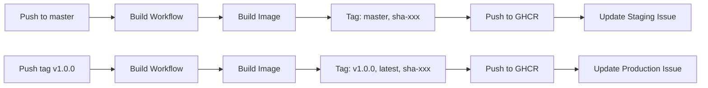

# Docker Build Quick Reference

## Common Commands

### View Built Images

```bash
# List all images
docker images ghcr.io/steveclarke/lr-backend

# Check specific tag
docker pull ghcr.io/steveclarke/lr-backend:sha-abc123
docker image inspect ghcr.io/steveclarke/lr-backend:sha-abc123
```

### Pull Images by Tag Type

```bash
# Latest staging (master branch)
docker pull ghcr.io/steveclarke/lr-backend:master

# Latest production
docker pull ghcr.io/steveclarke/lr-backend:latest

# Specific version
docker pull ghcr.io/steveclarke/lr-backend:v1.0.0

# Immutable commit
docker pull ghcr.io/steveclarke/lr-backend:sha-abc123

# Most immutable (by digest)
docker pull ghcr.io/steveclarke/lr-backend@sha256:abc123...
```

### Test an Image

```bash
# Check Ruby/Rails version
docker run --rm ghcr.io/steveclarke/lr-backend:master bin/rails --version

# Run console
docker run --rm -it ghcr.io/steveclarke/lr-backend:master bin/rails console

# Check environment
docker run --rm ghcr.io/steveclarke/lr-backend:master env | grep RAILS
```

### Find Image Info from CI

```bash
# Get digest from latest workflow run
gh run view --log | grep "digest:"

# List recent images
gh api /user/packages/container/lr-backend/versions --jq '.[].metadata.container.tags[]'
```

## Workflow Commands

### Trigger Manual Build

```bash
# Via GitHub CLI
gh workflow run docker-build-push.yml

# Via Web UI
# Go to Actions → Build and Push Docker Images → Run workflow
```

### Check Build Status

```bash
# List recent runs
gh run list --workflow=docker-build-push.yml

# View specific run
gh run view <run-id>

# Watch live
gh run watch
```

## Tag Cheat Sheet

| Tag Type | Example | Use Case | Immutable? |
|----------|---------|----------|------------|
| SHA | `sha-abc123` | Reproducible deployments | ✅ Yes |
| Master | `master` | Latest staging | ❌ No |
| Version | `v1.0.0` | Production release | ✅ Yes |
| Latest | `latest` | Latest production | ❌ No |
| Digest | `@sha256:...` | Most immutable | ✅ Yes |

## CI/CD Flow



## Emergency Procedures

### Build Fails on CI

1. Check workflow logs in Actions tab
2. Reproduce locally: `cd backend && bin/docker-build`
3. Fix issue and push
4. CI rebuilds automatically

### Need Immediate Hotfix

```bash
# Build locally
cd backend
bin/docker-build --local  # or without --local for prod platform
bin/docker-push

# Or trigger CI build
gh workflow run docker-build-push.yml
```

### Image Not Found

```bash
# Check if image exists on GHCR
gh api /user/packages/container/lr-backend/versions

# Check recent builds
gh run list --workflow=docker-build-push.yml --limit 5

# Verify tag exists
docker manifest inspect ghcr.io/steveclarke/lr-backend:sha-abc123
```

## Integration with Deployment

### Using deploy/bin/deploy Script

The deploy script uses the `BACKEND_IMAGE` config:

```bash
# .config/prod.env
BACKEND_IMAGE=ghcr.io/steveclarke/lr-backend:latest
```

**Best practice for production:**
Use SHA tags or digests for immutability:

```bash
# Immutable by SHA
BACKEND_IMAGE=ghcr.io/steveclarke/lr-backend:sha-abc123

# Most immutable by digest
BACKEND_IMAGE=ghcr.io/steveclarke/lr-backend@sha256:abc123...
```

### Updating Deployed Version

```bash
# Edit config
vim .config/prod.env
# Change BACKEND_IMAGE to new tag

# Deploy
bin/deploy prod
```

## Debugging

### Image Size Issues

```bash
# Check layer sizes
docker history ghcr.io/steveclarke/lr-backend:latest

# Compare with local build
cd backend
docker build -t test-build .
docker history test-build
```

### Platform Issues

```bash
# Check image platform
docker image inspect ghcr.io/steveclarke/lr-backend:latest \
  --format='{{.Os}}/{{.Architecture}}'

# Should be: linux/amd64
```

### Cache Problems

If builds are slow or behaving strangely:

1. Clear GitHub Actions cache:
   - Settings → Actions → Caches → Delete all
2. Rebuild from scratch:
   - Edit workflow: add `no-cache: true` to build step

## Links

- [Docker Build Automation](./docker-automation.md) - Full documentation
- [GHCR Package](https://github.com/steveclarke/link-radar/pkgs/container/lr-backend) - View all images
- [Workflow File](/.github/workflows/docker-build-push.yml) - Source of truth

