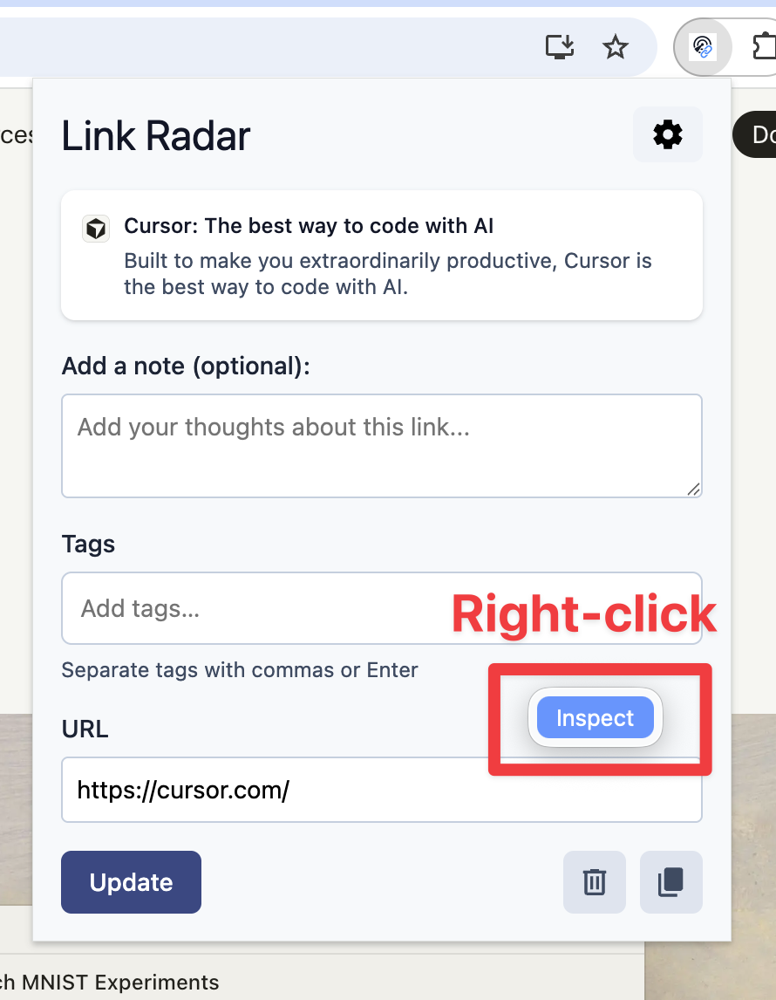
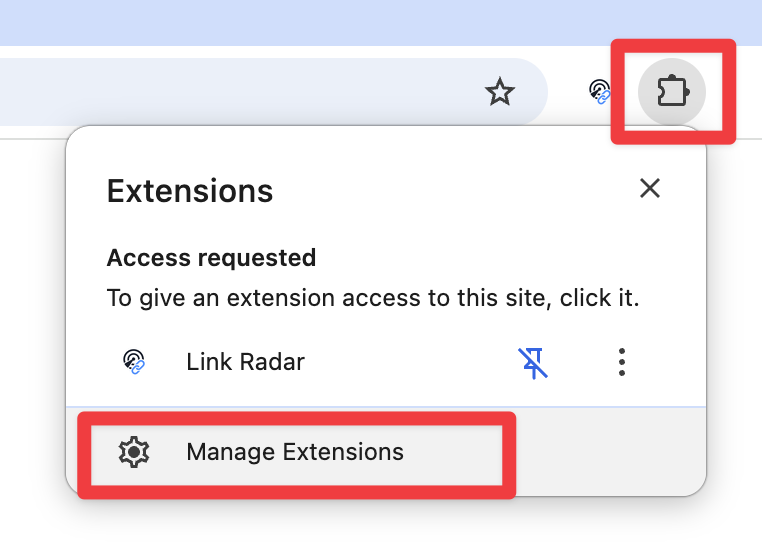
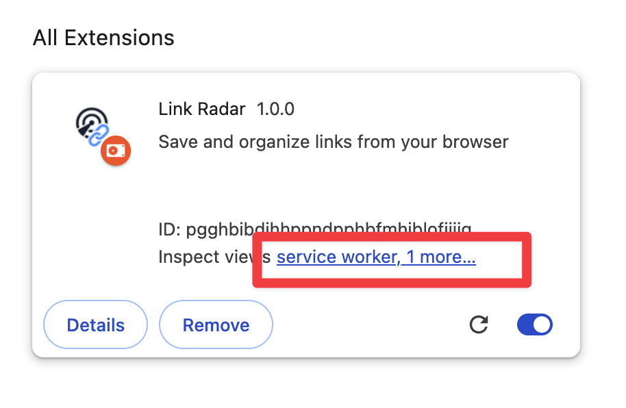

# Chrome Extension Debugging Guide

Quick reference for inspecting different parts of the Link Radar extension.

---

## 🎯 Quick Navigation

| Component | Where to Find Console Errors | How to Access |
|-----------|------------------------------|---------------|
| **Popup** | Popup DevTools | Right-click inside popup → Inspect |
| **Options/Settings Page** | Options Page DevTools | Open settings page → Press F12 |
| **Background Script** | Background DevTools | `chrome://extensions` → "Inspect views: service worker" |

---

## 1. Debugging the Popup

**When to use:** Debugging the main extension popup (icon click)

### Steps:
1. Click the Link Radar extension icon to open the popup
2. **Right-click anywhere inside the popup**
3. Select **"Inspect"** from the context menu
4. DevTools opens in a separate window
5. Check the **Console tab** for errors

**⚠️ Important:** The popup must stay open while debugging. If it closes, DevTools closes too.

---

## 2. Debugging the Options/Settings Page

**When to use:** Debugging the settings/configuration page

### Steps:
1. Right-click the extension icon → **"Options"** (or click the settings gear in the popup)
2. Once the options page loads, press **F12** (or right-click → Inspect)
3. DevTools opens like a regular webpage
4. Check the **Console tab** for errors

**💡 Tip:** This is the easiest to debug since it behaves like a normal webpage.

---

## 3. Debugging the Background Script / Service Worker

**When to use:** Debugging background processes, API calls, or extension lifecycle events

### Steps:
1. Navigate to **`chrome://extensions`** in your browser
   - Or click the extension icon → puzzle icon → **"Manage Extensions"**

2. Find **"Link Radar"** in the list
3. Click **"Inspect views: service worker"** (or "1 more..." if there are multiple views)

4. A DevTools window opens specifically for the background script
5. Check the **Console tab** for errors

**⚠️ Important:** 
- Background service workers may go inactive when not in use
- If you don't see "service worker", the background script hasn't started yet
- Clicking "Inspect views" will wake it up

---

## 🔍 Common Debugging Scenarios

### "Extension won't load at all"
1. Check `chrome://extensions` for a red **"Errors"** button
2. Click it to see build/manifest errors
3. Check the service worker console (Step 3 above)

### "Popup shows blank/broken UI"
1. Open popup → Right-click → Inspect (Step 1)
2. Look for React/Vue errors in Console
3. Check Network tab for failed API calls

### "Settings page broken"
1. Open options page → Press F12 (Step 2)
2. Check Console for Vue component errors
3. Check Application tab → Storage → Local/Sync Storage

### "Background tasks not working"
1. Inspect service worker (Step 3)
2. Check for storage permission errors
3. Look for API/network failures

---

## 💾 Checking Storage

### View Stored Settings:
1. Open any DevTools (popup, options, or background)
2. Go to **Application tab** (or **Storage** in Firefox)
3. Expand **Storage** → **Local Storage** or **Sync Storage**
4. Look for keys starting with `linkradar_`

**Storage Types:**
- **`browser.storage.local`** - Device-only data (API keys, sensitive info)
- **`browser.storage.sync`** - Synced across browsers (preferences, settings)

---

## 🔧 Development Tips

1. **Keep DevTools open** - Leave background service worker DevTools open to prevent it from sleeping
2. **Use console.log strategically** - Add logs in code, then check the appropriate DevTools window
3. **Reload extension** - After code changes, click reload button in `chrome://extensions`
4. **Clear storage** - If testing fresh state, clear storage in Application tab before reloading

---

## 📝 Quick Reference

**Can't find errors?**  
✅ Check ALL three places (popup, options, background) - errors might appear in unexpected locations

**Extension reloading?**  
✅ After code changes, reload in `chrome://extensions` AND refresh any open extension pages

**Storage issues?**  
✅ Check Application tab → Storage to verify data is being saved correctly

