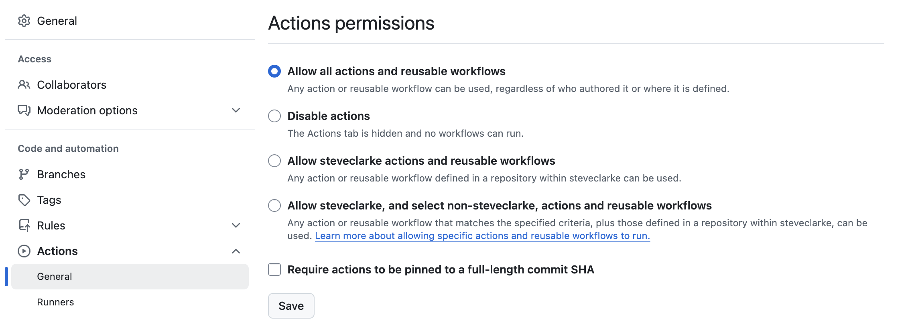
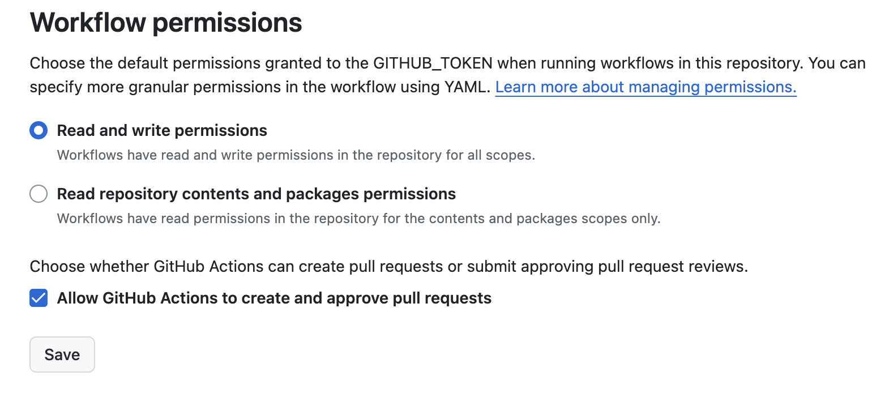
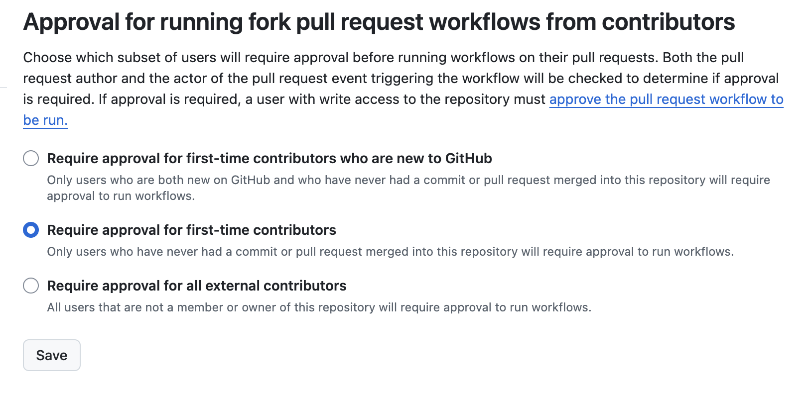
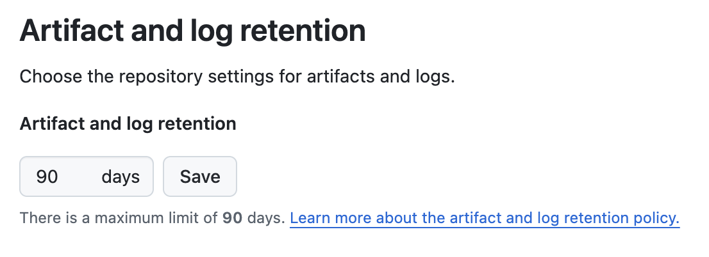

# GitHub Actions Setup Guide

## Overview

This guide documents how to configure GitHub Actions permissions for LinkRadar's CI/CD workflows. Proper permissions configuration ensures workflows can automate tasks like validation, status checks, and issue creation while maintaining security.

**What are GitHub Actions?**

GitHub Actions is GitHub's built-in CI/CD and automation platform. It allows you to run workflows that respond to repository events (pushes, PRs, releases) and perform automated tasks.

**Why This Matters:**

- **Enables automation** - CI validation, deployment triggers, dependency updates
- **Controls access** - Workflows can only do what you explicitly allow
- **Secure by default** - Automatic tokens with limited scope and lifetime
- **Foundation for Phase 2/3** - Validation workflows and deployment tracking

## GitHub Actions Architecture

### How Actions Work

**Workflows** - YAML files in `.github/workflows/` that define automation  
**Jobs** - Groups of steps that run on the same runner  
**Steps** - Individual tasks (commands or actions) within a job  
**Triggers** - Events that cause workflows to run (push, pull_request, etc.)

**Example workflow structure:**
```yaml
name: My Workflow
on: [push]
jobs:
  build:
    runs-on: ubuntu-latest
    steps:
      - uses: actions/checkout@v4
      - run: echo "Hello World"
```

### GITHUB_TOKEN Explained

Every workflow run gets an automatic `GITHUB_TOKEN`:

- **Automatically created** - No manual setup needed
- **Scoped to repository** - Can only access the current repo
- **Limited lifetime** - Expires when the job completes
- **Permission-based** - Has only the permissions you grant

**Accessing the token:**
```yaml
env:
  GH_TOKEN: ${{ github.token }}
```

### Security Model

**Principle of Least Privilege:**
- Grant only the minimum permissions needed
- Specify permissions explicitly in workflow files
- Can be more restrictive per-workflow, never more permissive

**Permission Levels:**
- **Repository-wide** - Default permissions for all workflows (read/write)
- **Per-workflow** - Override defaults with more restrictive permissions
- **Per-job** - Further restrict within specific jobs

## Permissions Explained

### Actions Permissions

**What it controls:** Which actions are allowed to run in workflows.

**Options:**

1. **Allow all actions and reusable workflows** ✅ (Recommended)
   - Any action from any source can be used
   - Maximum flexibility
   - Can restrict later if needed

2. **Allow local and select non-local actions**
   - Only actions in this repo and specific allowed actions
   - More restrictive but requires maintenance

3. **Allow only specific actions**
   - Whitelist-only approach
   - Most restrictive

**Why we use "Allow all":**
- Simple and flexible for getting started
- Can tighten later as needs become clear
- Most third-party actions require this setting



### Workflow Permissions

**What it controls:** Default permissions for the GITHUB_TOKEN.

**Options:**

1. **Read repository contents (default)**
   - Workflows can read but not modify anything
   - Very restrictive
   - Many workflows will fail

2. **Read and write permissions** ✅ (Recommended)
   - Workflows can read and modify repository resources
   - Required for: creating issues, commenting on PRs, updating statuses
   - Still scoped to the repository

**Why we use "Read and write":**
- Phase 2 validation workflows need to comment on PRs
- Phase 3 deployment workflows need to create issues
- Most CI/CD workflows require write access



### Allow GitHub Actions to Create and Approve Pull Requests

**What it controls:** Can workflows create or approve PRs?

**Why enable it:**
- Useful for automated dependency updates (Dependabot, Renovate)
- Allows workflows to create PRs for code generation
- Future automation possibilities

**Security note:**
- PRs created by workflows still go through branch protection
- Can't be used to bypass required reviews (when configured properly)



### Fork Pull Request Workflows

**What it controls:** How workflows run on PRs from forked repositories.

**Options:**

1. **Require approval for first-time contributors** ✅ (Recommended for public repos)
   - First PR from a new contributor requires manual approval
   - Prevents malicious PRs from running arbitrary code
   - After first approval, subsequent PRs run automatically

2. **Require approval for all outside collaborators**
   - Every PR from fork requires approval
   - Most restrictive

3. **Run workflows from PRs automatically**
   - No approval needed
   - Risky for public repos

**Why we use "first-time only":**
- Balances security with usability
- Prevents abuse while not hampering legitimate contributors
- Standard practice for open source projects



### Artifacts and Logs Retention

**What it controls:** How long workflow artifacts and logs are kept.

**Default:** 90 days

**Why the default is fine:**
- Plenty of time to review logs
- Artifacts automatically cleaned up
- Can adjust later if storage becomes an issue

## Manual Setup

### Step-by-Step Instructions

1. **Navigate to Actions Settings**
   - Go to your repository on GitHub
   - Click **Settings** tab
   - Click **Actions** in the left sidebar  
   - Click **General**

2. **Configure Actions Permissions**
   - Under "Actions permissions"
   - Select **"Allow all actions and reusable workflows"**
   - This allows maximum flexibility for workflows

3. **Set Workflow Permissions**
   - Scroll to "Workflow permissions" section
   - Select **"Read and write permissions"**
   - Check ☑ **"Allow GitHub Actions to create and approve pull requests"**

4. **Configure Fork PR Workflows**
   - Scroll to "Fork pull request workflows from outside collaborators"
   - Select **"Require approval for first-time contributors"**
   - This balances security with usability

5. **Verify Artifacts Settings**
   - Scroll to "Artifact and log retention"
   - Confirm it's set to **90 days** (default)
   - Adjust only if you have specific requirements

6. **Save Settings**
   - Click **Save** button at the bottom
   - Settings are now active

### Verification

After configuring, verify settings are correct:

✅ Actions permissions: "Allow all actions"  
✅ Workflow permissions: "Read and write"  
✅ Allow PR creation: Checked  
✅ Fork PR approval: "First-time contributors"  
✅ Artifacts retention: 90 days

## What Phase 2/3 Workflows Need

### Phase 2: CI Validation Workflows

**Conventional Commits Checker**
- Validates commit messages follow format
- **Needs:** `pull-requests: write` (comment results), `statuses: write` (update checks)

**Required Labels Checker**
- Verifies PRs have type + area labels
- **Needs:** `pull-requests: write` (comment if missing), `statuses: write`

**YAML/Markdown Linter**
- Validates syntax of YAML and Markdown files
- **Needs:** `contents: read` (read files), `pull-requests: write` (comment issues)

**All Phase 2 workflows:**
```yaml
permissions:
  contents: read
  pull-requests: write
  statuses: write
```

### Phase 3: Deployment Trigger Placeholders

**Merge to Master Trigger**
- Creates GitHub issue when code merges to master
- **Needs:** `contents: read`, `issues: write`

**Tag Push Trigger**
- Creates GitHub issue when tags are pushed
- **Needs:** `contents: read`, `issues: write`

**All Phase 3 workflows:**
```yaml
permissions:
  contents: read
  issues: write
```

## Permission Scopes Reference

| Scope | Read | Write | Phase 2 | Phase 3 |
|-------|------|-------|---------|---------|
| `contents` | ✅ | ❌ | ✅ | ✅ |
| `pull-requests` | ✅ | ✅ | ✅ | ❌ |
| `issues` | ✅ | ✅ | ❌ | ✅ |
| `statuses` | ✅ | ✅ | ✅ | ❌ |
| `checks` | ✅ | ✅ | Optional | ❌ |

**Key Permissions:**

- **`contents: read`** - Read repository files and code
- **`pull-requests: write`** - Create comments, request reviews
- **`issues: write`** - Create, update, close issues
- **`statuses: write`** - Update commit status checks
- **`checks: write`** - Create check runs (alternative to statuses)

## Security Best Practices

### Least Privilege Principle

**Always specify permissions explicitly:**
```yaml
jobs:
  my-job:
    permissions:
      contents: read
      issues: write
    # Only grant what this job needs
```

**Don't rely on defaults:**
- Even with "read and write" at repo level
- Explicit permissions document intent
- Easier to audit security

### Token Safety

**Never log or expose tokens:**
```yaml
# ❌ BAD
- run: echo "Token: ${{ github.token }}"

# ✅ GOOD  
- run: gh issue create --title "Test"
  env:
    GH_TOKEN: ${{ github.token }}
```

**Don't store in variables unnecessarily:**
- Pass directly to commands via env
- Token expires after job completes
- No persistence risk

### Third-Party Actions

**Use trusted actions:**
- ✅ Official actions (actions/checkout, actions/setup-node)
- ✅ Well-known maintainers (docker, aws-actions)
- ✅ High star count and active maintenance

**Pin to commits, not tags:**
```yaml
# ❌ Less secure (tags can be moved)
uses: actions/checkout@v4

# ✅ More secure (commits are immutable)
uses: actions/checkout@b4ffde65f46336ab88eb53be808477a3936bae11  # v4.1.1
```

**Review action source code:**
- Check what the action does
- Look for permission requests
- Verify it's doing what you expect

## Testing Actions Permissions

### Test Workflow

A simple workflow to verify permissions are configured correctly:

```yaml
name: Test Permissions

on:
  workflow_dispatch:  # Manual trigger

jobs:
  test:
    runs-on: ubuntu-latest
    permissions:
      contents: read
      issues: write
    
    steps:
      - name: Checkout code
        uses: actions/checkout@v4
      
      - name: Test issue creation
        run: |
          gh issue create \
            --title "Test: Permissions Check" \
            --body "Testing GitHub Actions permissions." \
            --label "type: chore"
        env:
          GH_TOKEN: ${{ github.token }}
```

**Location:** `.github/workflows/test-permissions.yml`

### Running the Test

1. **Merge to master** - Workflow must be on default branch
2. **Go to Actions tab** on GitHub
3. **Click "Test Permissions"** workflow
4. **Click "Run workflow"** button
5. **Select branch** (master)
6. **Click green "Run workflow"** button

### Expected Results

✅ **Workflow runs successfully**
- Job completes without errors
- Green checkmark in Actions tab

✅ **Test issue created**
- New issue appears with title "Test: Permissions Check"
- Has label "type: chore"
- Created by "github-actions" bot

✅ **Clean up**
- Close the test issue
- Delete `.github/workflows/test-permissions.yml` (optional)

### Troubleshooting Failed Tests

**Error: "Resource not accessible by integration"**
- **Cause:** Insufficient permissions
- **Fix:** Verify "Read and write permissions" is enabled
- **Check:** Workflow file has correct `permissions` block

**Error: "Label not found"**
- **Cause:** Label doesn't exist in repository
- **Fix:** Create the label or remove `--label` flag from test

**Issue not created:**
- **Check:** Workflow ran successfully
- **Check:** Look at workflow logs for errors
- **Check:** `issues: write` permission is set

## Automation Script

**Note:** GitHub Actions settings are primarily UI-only and cannot be fully automated via API. Manual configuration is required.

A partial setup script could document the manual steps:

```bash
#!/bin/bash
# GitHub Actions Setup Script
# 
# Note: Actions settings must be configured manually via GitHub UI
# This script documents the required settings.

echo "GitHub Actions Setup for LinkRadar"
echo ""
echo "⚠️  Manual configuration required:"
echo ""
echo "Go to: https://github.com/$REPO/settings/actions"
echo ""
echo "Required settings:"
echo "  1. Actions permissions: Allow all actions and reusable workflows"
echo "  2. Workflow permissions: Read and write permissions"
echo "  3. Allow GitHub Actions to create and approve pull requests: ✓"
echo "  4. Fork PR workflows: Require approval for first-time contributors"
echo "  5. Artifacts retention: 90 days (default)"
echo ""
echo "After configuration, test with the workflow in:"
echo "  .github/workflows/test-permissions.yml"
```

**Why no full automation:**
- GitHub doesn't expose these settings via API
- Organization-level settings may override
- Manual verification is recommended for security settings

## Common Issues

### Workflow Can't Create Issues

**Error:** `Resource not accessible by integration`

**Causes:**
- Workflow permissions set to "Read" only
- Missing `issues: write` in workflow file
- Organization settings override repository settings

**Fixes:**
1. Go to Settings → Actions → General
2. Set Workflow permissions to "Read and write"
3. Add explicit permissions to workflow:
   ```yaml
   permissions:
     issues: write
   ```

### Workflow Can't Comment on PRs

**Error:** `Resource not accessible by integration` when commenting

**Causes:**
- Workflow permissions insufficient
- Missing `pull-requests: write`

**Fixes:**
1. Enable "Read and write permissions"
2. Add to workflow:
   ```yaml
   permissions:
     pull-requests: write
   ```

### Status Checks Not Appearing

**Problem:** Workflow runs but PR doesn't show status

**Causes:**
- Missing `statuses: write` permission
- Check name mismatch with branch protection rules
- Workflow not triggered correctly

**Fixes:**
1. Add `statuses: write` permission
2. Verify workflow is triggered on `pull_request`
3. Check branch protection required check names match

### Third-Party Action Fails

**Error:** Various permission errors from actions

**Causes:**
- Action needs more permissions than granted
- Action expects specific permissions
- Action documentation incomplete

**Fixes:**
1. Check action's documentation for required permissions
2. Add missing permissions to workflow
3. Consider using a different action if permissions are excessive

## For Future Projects

### Lifting to New Repos

To configure Actions in a new repository:

1. **Navigate to Settings → Actions → General**
2. **Apply the same settings:**
   - Allow all actions
   - Read and write permissions
   - Allow PR creation
   - First-time contributor approval
3. **Copy test workflow** to verify
4. **Run test and clean up**

**Quick checklist:**
- [ ] Actions permissions: Allow all
- [ ] Workflow permissions: Read and write
- [ ] PR creation: Enabled
- [ ] Fork PR: First-time approval
- [ ] Test workflow runs successfully

### Team Scaling

As your team grows:

**Review workflow file access:**
- Protected branch rules apply to `.github/workflows/`
- Require reviews for workflow changes
- Audit who can modify automation

**Audit action usage:**
- Review third-party actions regularly
- Update to latest versions
- Remove unused actions

**Consider more restrictions:**
- Whitelist specific actions only
- Require organization approval for new actions
- Use private actions for sensitive operations

**Organization-level settings:**
- Set org-wide defaults
- Disable Actions in specific repos
- Centralized policy management

## Preparing for Phase 2 & 3

### What's Next

After this setup:
- ✅ Actions enabled and configured
- ✅ Permissions grant workflows necessary access
- ✅ Test workflow validates configuration
- ⏭️ Ready to create Phase 2 validation workflows
- ⏭️ Ready to create Phase 3 deployment triggers

### Phase 2 Workflows to Create

**Conventional Commits Check**
- File: `.github/workflows/conventional-commits.yml`
- Trigger: `pull_request`
- Validates: Commit message format
- Actions: Comment if invalid, update status

**Required Labels Check**
- File: `.github/workflows/required-labels.yml`
- Trigger: `pull_request`
- Validates: Type + area labels present
- Actions: Comment if missing, update status

**Lint Check**
- File: `.github/workflows/lint.yml`
- Trigger: `pull_request`, `push`
- Validates: YAML, Markdown syntax
- Actions: Comment issues, update status

### Phase 3 Workflows to Create

**Staging Deployment Placeholder**
- File: `.github/workflows/deploy-staging-placeholder.yml`
- Trigger: `push` to `master`
- Actions: Create GitHub issue with merge details

**Production Deployment Placeholder**
- File: `.github/workflows/deploy-production-placeholder.yml`
- Trigger: `push` (tags matching `v*`)
- Actions: Create GitHub issue with release details

### Update Branch Protection

Once Phase 2 workflows are created:

1. Edit your branch ruleset (or import updated JSON)
2. Enable "Require status checks to pass"
3. Add required checks:
   - `conventional-commits`
   - `required-labels`
   - `lint`
4. PRs will be blocked until all checks pass

## References

- [GitHub Actions Documentation](https://docs.github.com/en/actions)
- [GITHUB_TOKEN Permissions](https://docs.github.com/en/actions/security-guides/automatic-token-authentication#permissions-for-the-github_token)
- [Security Hardening for Actions](https://docs.github.com/en/actions/security-guides/security-hardening-for-github-actions)
- [Workflow Syntax](https://docs.github.com/en/actions/using-workflows/workflow-syntax-for-github-actions)
- [Actions Security Best Practices](https://docs.github.com/en/actions/security-guides/security-hardening-for-github-actions#using-third-party-actions)

