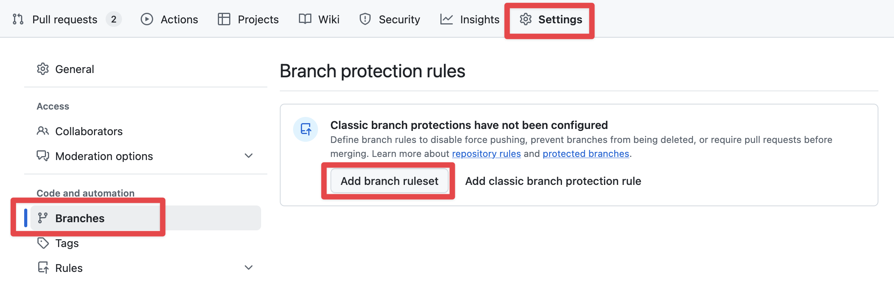
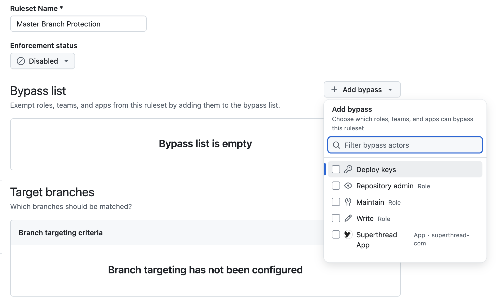
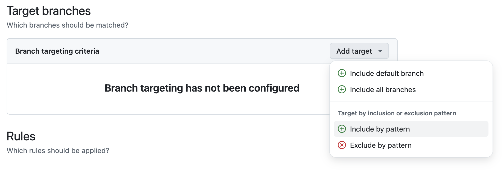
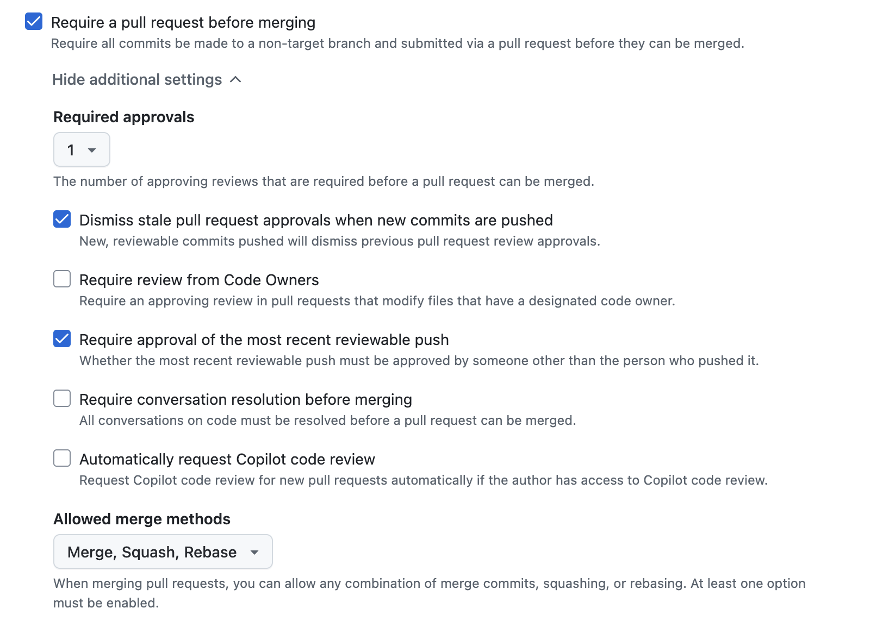

# Branch Ruleset Setup Guide

## Overview

This guide documents how to set up GitHub branch rulesets to protect LinkRadar's default branch (master). Branch rulesets enforce our PR-based workflow, requiring all changes to go through review before merging.

**What are Branch Rulesets?**

Branch rulesets are GitHub's modern branch protection system that defines rules for how collaborators can interact with branches. They replace (and improve upon) classic branch protection rules with more flexibility and power.

**Why This Matters:**

- **Enforces workflow** - All changes must go through pull requests
- **Prevents mistakes** - Can't accidentally push directly to master
- **Requires review** - Quality gate before merging (even for solo developers)
- **Maintains history** - Linear Git history, no merge commits
- **Team-ready** - Scales from 1 person to 50 without changes

## Rulesets vs Classic Protection

GitHub offers two branch protection systems:

| Feature | Classic Protection | Branch Rulesets (Modern) |
|---------|-------------------|--------------------------|
| **Status** | Legacy system | Current/future-proof |
| **Target branches** | One branch per rule | Multiple branches via patterns |
| **Bypass modes** | On/off only | Granular (always/PR-only/exempt) |
| **Organization-wide** | No | Yes |
| **Flexibility** | Limited | Highly flexible |

**We use rulesets** because they're more powerful and GitHub's investment for the future.

## Ruleset Settings Explained

### Enforcement Status

**What it does:** Controls whether the ruleset actually blocks actions or just evaluates them.

- **Active** - Enforces all rules (blocks violations)
- **Evaluate** - Logs violations but allows them (testing mode)
- **Disabled** - Ruleset exists but doesn't run

**Why we use it:** Set to **Active** to actually enforce the workflow.

**How it works:** When active, git operations that violate rules are rejected with an error message.

### Target Branches

**What it does:** Defines which branches the ruleset applies to.

Options:
- **Include default branch** - Targets the repository's default branch
- **Include by pattern** - Target branches matching a pattern (e.g., `release/*`)
- **Include all branches** - Apply to every branch

**Why we use it:** **Include default branch** is simpler and automatically follows if you rename master → main.

**How it works:** The ruleset checks if a branch matches the target before applying rules.

### Bypass List

**What it does:** Allows specific roles, teams, or apps to bypass some or all rules.

Bypass modes:
- **Always** - Can bypass rules anywhere (CLI, UI, everywhere)
- **For pull requests only** - Can bypass when merging PRs in GitHub UI
- **Exempt** - Never subject to the ruleset at all

**Why we use it:** **Repository admin with "For pull requests only"** gives an emergency escape hatch without allowing command-line bypasses.

**How it works:** When you try an action that violates rules, you'll see a checkbox to bypass (if you have permission).

### Rules

#### Restrict Deletions

**What it does:** Prevents the branch from being deleted.

**Why we use it:** Master should never be deleted.

**How it works:** `git push --delete master` will be rejected.

#### Require Linear History

**What it does:** Prevents merge commits from being pushed to the branch.

**Why we use it:** Keeps Git history clean and easy to understand. Enforces squash merging.

**How it works:** Only allows fast-forward merges and squash merges, not regular merge commits.

#### Require Pull Request Before Merging

**What it does:** All changes must go through a pull request; direct pushes are blocked.

Parameters:
- **Required approvals** - How many approving reviews needed (we use: 1)
- **Dismiss stale reviews** - Invalidate approvals when new commits pushed (we use: yes)
- **Require code owner review** - Specific people must approve (we use: no, solo dev)
- **Require last push approval** - Can't approve your own latest changes (we use: yes)
- **Require conversation resolution** - All review comments must be resolved (we use: no)

**Why we use it:** Enforces the PR workflow and prevents accidental direct pushes.

**How it works:** `git push origin master` is rejected; must push to feature branch and create PR.

#### Block Force Pushes

**What it does:** Prevents `git push --force` to the branch.

**Why we use it:** Protects against accidental history rewrites.

**How it works:** Any force push attempt is rejected.

#### Require Status Checks (Phase 2)

**What it does:** CI workflows must pass before merging.

**Why we defer it:** No CI workflows exist yet. Will add in Phase 2 with:
- conventional-commits
- required-labels  
- yaml-lint

**How it will work:** PRs can't be merged until all required checks pass.

## Settings Summary

| Rule | Enabled | Why |
|------|---------|-----|
| Require PR | ✅ | Enforces review workflow |
| Required approvals | ✅ (1) | Quality gate |
| Last push approval | ✅ | Re-review after changes |
| Linear history | ✅ | Clean Git history |
| Bypass: Admins (PR only) | ✅ | Emergency escape hatch |
| Block force pushes | ✅ | Prevent history rewrites |
| Restrict deletions | ✅ | Prevent accidental deletion |
| Status checks | ⚠️ Phase 2 | Will add when CI workflows exist |

## Manual Setup (Learning Path)

### Step-by-Step Instructions

1. **Navigate to Repository Settings**
   - Go to your repository on GitHub
   - Click **Settings** tab
   - Click **Branches** in the left sidebar

2. **Click "Add branch ruleset"**
   - You'll see two buttons: "Add branch ruleset" and "Add classic branch protection rule"
   - Click **"Add branch ruleset"** (the left button)
   - NOT the classic protection option



3. **Configure Ruleset Name**
   - Name: `Master Branch Protection`
   - This helps identify the ruleset later

4. **Set Enforcement Status**
   - Change dropdown from "Disabled" to **"Active"**
   - This makes the ruleset actually enforce

5. **Add Bypass Permission**
   - Click "Add bypass"
   - Select **"Repository admin"**
   - Click the three-dot menu next to it
   - Select **"For pull requests only"** (NOT "Always")
   - This allows emergency overrides in PR UI but blocks command-line bypasses



6. **Configure Target Branch**
   - Click "Add target"
   - Select **"Include default branch"**
   - Simpler than pattern matching, automatically follows if you rename branches



7. **Enable Branch Rules**

Check these boxes in order:

☑ **Restrict deletions** - Prevents branch deletion

☑ **Require linear history** - Enforces squash merging

☑ **Require a pull request before merging** - This expands with sub-options:
  - ☑ **Required approvals: 1**
  - ☑ **Dismiss stale pull request approvals when new commits are pushed**
  - ☑ **Require approval of the most recent reviewable push**
  - ☐ Require review from Code Owners (not needed for solo)
  - ☐ Require conversation resolution (optional)



☐ **Require status checks to pass** - Leave UNCHECKED (Phase 2)
  - Will add later when CI workflows exist

☑ **Block force pushes** - Prevents history rewrites

☐ **Require signed commits** - Optional, can add later

8. **Save Ruleset**
   - Click the green **"Create"** button at the bottom
   - Ruleset is now active!

### What Each Setting Does

As you click through the UI, you'll notice:
- Some rules have additional parameters (like PR requirements)
- "For pull requests only" bypass shows a checkbox when merging PRs
- The default branch target shows which branch it will protect
- Active enforcement means rules are actually enforced, not just evaluated

## Automated Setup (Production Path)

### Method 1: Import JSON Ruleset (Recommended)

The simplest way to replicate this ruleset in other repos is to import the JSON file:

**Steps:**
1. Go to your new repository's Settings → Branches
2. Click "New ruleset" dropdown
3. Select **"Import a ruleset"**
4. Choose the `ruleset.json` file from this directory
5. Review and save

**Why this is better:**
- ✅ No API scripting needed
- ✅ Visual confirmation before importing
- ✅ GitHub validates the JSON
- ✅ Can edit in UI after import

**The JSON file:** `project/guides/github/setup/branch-protection/ruleset.json`

This file contains your exact configuration:
- ~DEFAULT_BRANCH targeting
- "pull_request" bypass mode
- All rules and parameters

### Exporting Your Ruleset

To export your ruleset as JSON (for documentation or sharing):

1. Go to Settings → Branches
2. Click the **"..."** menu next to your ruleset
3. Select **"Export"**
4. Save the JSON file
5. Clean up repo-specific fields (`id`, `source`, `source_type`) before committing

### Method 2: Using the API Script

If you prefer automation via CLI, the script replicates the setup using GitHub's API:

```bash
cd project/guides/github/branch-protection
./setup.sh your-username/your-repo
```

**Example:**
```bash
./setup.sh steveclarke/link-radar
```

### What the Script Does

1. **Creates ruleset via API** - Uses `gh api repos/{repo}/rulesets` endpoint
2. **Sets enforcement to active** - Ruleset is immediately enforced
3. **Targets default branch** - Uses `~DEFAULT_BRANCH` special token
4. **Configures bypass** - Actor ID 5 (Repository Admin) with `pull_request` mode
5. **Applies all rules** - Deletion, linear history, PR requirements, force push blocking

### Script Breakdown

**API Endpoint:**
```bash
gh api repos/"$REPO"/rulesets --method POST
```

**Key Fields:**
- `-f name` - Ruleset name shown in UI
- `-f enforcement="active"` - Actually enforce (not just evaluate)
- `-f target="branch"` - This is a branch ruleset (not tag ruleset)
- `-f bypass_actors` - Who can bypass and how
- `-f conditions` - What branches to target
- `-f rules` - Array of rule objects to apply

**Bypass Configuration:**
```json
{
  "actor_id": 5,
  "actor_type": "RepositoryRole",
  "bypass_mode": "pull_request"
}
```
- Actor ID 5 = Repository Admin role
- `pull_request` mode = bypass only in PR context

**Target Configuration:**
```json
{
  "ref_name": {
    "include": ["~DEFAULT_BRANCH"],
    "exclude": []
  }
}
```
- `~DEFAULT_BRANCH` = GitHub's special token for default branch
- Automatically follows if you rename master → main

**Rule Types:**
- `deletion` - Block branch deletion
- `required_linear_history` - Enforce squash/rebase
- `pull_request` - PR requirements with parameters
- `non_fast_forward` - Block force pushes

### Customizing the Script

**Change approval count:**
```json
"required_approving_review_count": 2  // Require 2 approvals
```

**Remove admin bypass:**
```bash
-f bypass_actors='[]'  // Empty array = no bypass
```

**Target multiple branches:**
```json
"ref_name": {
  "include": ["~DEFAULT_BRANCH", "refs/heads/release/*"],
  "exclude": []
}
```

**Add status checks (Phase 2):**
```json
{
  "type": "required_status_checks",
  "parameters": {
    "strict_required_status_checks_policy": true,
    "required_status_checks": [
      {"context": "conventional-commits"},
      {"context": "required-labels"},
      {"context": "yaml-lint"}
    ]
  }
}
```

## Testing Ruleset

### Verify It Works

Run these tests to confirm the ruleset is working:

**Test 1: Try Direct Push (Should Fail)**
```bash
git checkout master
echo "test" >> test.txt
git add test.txt
git commit -m "test: direct push attempt"
git push origin master
```

Expected: ❌ **Rejected**
```
remote: error: GH013: Repository rule violations found
remote: - Changes must be made through a pull request
```

**Test 2: Create Feature Branch (Should Succeed)**
```bash
git checkout -b test/branch-protection
echo "via PR" >> test.txt
git add test.txt
git commit -m "test: via pull request"
git push origin test/branch-protection
```

Expected: ✅ **Succeeds** - feature branches aren't protected

**Test 3: Create PR (Should Succeed)**
```bash
gh pr create --title "test: verify protection" --base master
```

Expected: ✅ **PR created**

**Test 4: Try Merge Without Approval (Should Fail)**
```bash
gh pr merge --squash
```

Expected: ❌ **Blocked** - "the base branch policy prohibits the merge"

**Test 5: Self-Approve (Should Fail)**

Try to approve your own PR in GitHub UI.

Expected: ❌ **Blocked** - "New changes require approval from someone other than the last pusher"

**Test 6: Bypass and Merge (Should Succeed)**

In GitHub UI, check the "Merge without waiting for requirements to be met" checkbox and merge.

Expected: ✅ **Succeeds** - admin bypass works in PR context

### Expected Behavior

**What You'll See:**

- Command-line pushes to master are **hard-blocked** (even for admins)
- Feature branches can be pushed normally
- PRs can be created without restrictions
- Merge button is **disabled** until requirements met
- A **bypass checkbox** appears if you're an admin (only in PR UI)
- Self-approval fails with clear error message

**Protection Messages:**

- `GH013: Repository rule violations found` - Ruleset blocked an action
- `Changes must be made through a pull request` - Direct push blocked
- `Review required` - Need approval to merge
- `Merging is blocked` - Requirements not met

## Working With Rulesets

### Daily Workflow

With rulesets active, your workflow becomes:

1. **Pull latest master**
   ```bash
   git checkout master && git pull origin master
   ```

2. **Create feature branch**
   ```bash
   git checkout -b feat/my-feature
   ```

3. **Make changes and commit**
   ```bash
   # ... make changes ...
   git add .
   git commit -m "feat(scope): add my feature"
   ```

4. **Push to GitHub**
   ```bash
   git push origin feat/my-feature
   ```

5. **Create draft PR**
   ```bash
   gh pr create --draft --title "feat(scope): Add my feature"
   ```

6. **Continue working**
   - Push additional commits as you work
   - Draft PR shows your progress

7. **Mark ready for review**
   ```bash
   gh pr ready
   ```

8. **Self-review the PR**
   - Use GitHub UI to review your own code
   - Look for issues you might have missed

9. **Merge with bypass**
   - In GitHub UI, check "Merge without waiting for requirements"
   - Click "Squash and merge"

10. **Clean up**
    ```bash
    git checkout master && git pull
    git branch -d feat/my-feature
    ```

### Emergency Bypass

**When to Use:**

- Critical production bug that needs immediate fix
- Automation fails and you need to unblock
- Testing changes to the ruleset itself

**How to Bypass (Admin Only):**

In the GitHub PR UI, you'll see:
```
☐ Merge without waiting for requirements to be met (bypass rules)
```

Check this box to bypass the ruleset rules.

**Important:**

- Only available to users with bypass permission (admins in our case)
- Only works in PR context (not command-line)
- Use sparingly - defeats the purpose of protection

### Understanding Enforcement Modes

**Active:**
- Rules are enforced
- Violations are blocked
- This is production mode

**Evaluate:**
- Rules are checked but not enforced
- Violations are logged but allowed
- Good for testing rules before activating

**Disabled:**
- Ruleset exists but doesn't run
- No checking or enforcement
- Useful for temporarily disabling without deleting

### Status Checks (Phase 2)

Once CI workflows are added, you'll need to:

1. **Edit the ruleset** in GitHub UI
2. **Enable "Require status checks to pass"**
3. **Add required checks:**
   - conventional-commits
   - required-labels
   - yaml-lint

Or run an updated version of the automation script that includes status checks.

## Common Issues

### Can't Push to Master

**Error:**
```
remote: error: GH013: Repository rule violations found
remote: - Changes must be made through a pull request
```

**Solution:** This is correct! Push to a feature branch instead:
```bash
git checkout -b feat/my-feature
git push origin feat/my-feature
```

### PR Won't Merge

**Error:** "Review required" or "Merging is blocked"

**Possible causes:**
1. **No approval** - Need at least 1 approval
2. **Self-approval blocked** - You can't approve your own PR
3. **New commits pushed** - Old approval was dismissed

**Solutions:**
- Wait for someone else to approve (team setting)
- Use bypass checkbox if you're an admin (solo setting)
- Check that you have the right permissions

### Status Checks Never Complete

(This will be relevant in Phase 2)

**Error:** PR shows "Waiting for status checks"

**Causes:**
- CI workflow hasn't run
- Workflow failed
- Workflow name doesn't match required check name

**Solutions:**
- Check Actions tab for workflow runs
- Fix failing tests
- Update required checks list if workflow renamed

### Ruleset vs Classic Conflicts

**Problem:** Have both classic protection and rulesets configured

**Symptoms:**
- Unexpected blocking behavior
- Confusing error messages
- Rules applying when they shouldn't

**Solution:**
- GitHub evaluates BOTH classic and rulesets
- Remove one or the other to avoid conflicts
- Rulesets are preferred (more modern)

### Can't Edit/Delete Ruleset

**Problem:** Ruleset appears locked or unchangeable

**Cause:** Organization-level rulesets override repository-level

**Solution:**
- Check if an org-level ruleset exists
- Org admins must edit org-level rulesets
- Repository rulesets can only be stricter, not looser

## For Future Projects

### Lifting to New Repos

To apply this ruleset to another repository:

**Method 1: Import JSON (Easiest)**
1. Go to new repo's Settings → Branches
2. Click "New ruleset" → "Import a ruleset"
3. Select `ruleset.json` from this directory
4. Review and save
5. Test with a dummy PR

**Method 2: Use API Script**
1. Run the script:
   ```bash
   cd project/guides/github/branch-protection
   ./setup.sh your-username/new-repo
   ```
2. Test with dummy PR

**Adjust if needed:**
- Different approval counts
- Different bypass permissions
- Additional branches to protect

### Organization-Wide Rulesets

For multiple repositories, create an org-level ruleset:

1. **Navigate to org settings**
   - Go to your GitHub organization
   - Settings → Repository rulesets

2. **Create org ruleset**
   - Similar UI to repository rulesets
   - Choose which repos to apply to

3. **Benefits:**
   - Apply to all repos at once
   - Consistent standards across org
   - Easier to manage at scale

4. **Repositories can:**
   - Add stricter rules (not looser)
   - Have repository-level rulesets in addition

### Team Scaling

As your team grows, consider:

**More approvals:**
- Change `required_approving_review_count` to 2 or more
- Reduces single points of failure

**Code owner reviews:**
- Set `require_code_owner_review` to true
- Create CODEOWNERS file
- Specific people must approve specific files

**Stricter bypass permissions:**
- Remove admin bypass entirely
- Or create a "Release Manager" team with bypass
- Limit who can override rules

**Additional status checks:**
- Security scanning
- Performance testing
- E2E tests
- Deployment previews

## Next Steps

After setting up branch protection:

1. **Verify with test PR** - Run the testing checklist above
2. **Update your workflow** - Get used to PR-based development
3. **Prepare for Phase 2** - CI checks will be added to the ruleset
4. **Document your learnings** - Note any surprises or adjustments

## References

- [GitHub Branch Rulesets Documentation](https://docs.github.com/en/repositories/configuring-branches-and-merges-in-your-repository/managing-rulesets/about-rulesets)
- [GitHub Rulesets API Documentation](https://docs.github.com/en/rest/repos/rules)
- [GitHub CLI Documentation](https://cli.github.com/manual/)
- [Migrating from Classic to Rulesets](https://docs.github.com/en/repositories/configuring-branches-and-merges-in-your-repository/managing-rulesets/about-rulesets#about-rulesets-and-classic-branch-protection)

