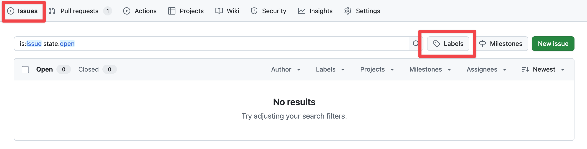

# GitHub Labels Setup Guide

## Overview

This guide documents LinkRadar's two-axis label taxonomy for organizing pull requests and issues. The system combines **Conventional Commits** types with our **monorepo structure** to create a powerful, scalable categorization system.

### Why This Approach?

**Two-Axis System:**
- **Type labels** answer: "What kind of change is this?" (feat, fix, docs, etc.)
- **Area labels** answer: "Where in the codebase does this affect?" (backend, extension, etc.)

**Benefits:**
- **Quick identification** - See at a glance what PRs are about
- **Powerful filtering** - Find "all backend features" or "all documentation fixes"
- **Team scaling** - Clear categorization when collaborators join
- **Automation-ready** - Foundation for automated workflows and enforcement

## Label Taxonomy

### Type Labels (Based on Conventional Commits)

| Label | Description | When to Use | Color |
|-------|-------------|-------------|-------|
| `type: feat` | New features | Adding new functionality | `#0052CC` |
| `type: fix` | Bug fixes | Fixing broken functionality | `#FF5630` |
| `type: docs` | Documentation | README, guides, comments | `#6B778C` |
| `type: style` | Code style/formatting | Formatting, linting (no logic) | `#00B8D9` |
| `type: refactor` | Code restructuring | Improving code without changing behavior | `#6554C0` |
| `type: test` | Test additions/changes | Adding or modifying tests | `#36B37E` |
| `type: chore` | Build, tools, dependencies | Package updates, tooling | `#FFAB00` |

### Area Labels (Based on Monorepo Structure)

| Label | Description | When to Use | Color |
|-------|-------------|-------------|-------|
| `area: backend` | Rails API backend | Changes to `/backend` | `#FF8B00` |
| `area: extension` | Browser extension | Changes to `/extension` | `#00C7B7` |
| `area: frontend` | Frontend SPA | Changes to frontend (future) | `#36B37E` |
| `area: cli` | CLI tool | Changes to CLI (future) | `#0065FF` |
| `area: infrastructure` | Docker, deployment, CI/CD | DevOps and infrastructure | `#6B778C` |
| `area: project` | Project docs and planning | Changes to `/project` | `#8777D9` |

### Recommended Labels to Keep from GitHub Defaults

These labels serve different purposes (status/collaboration) and complement your type/area labels:

| Label | Purpose | Example Use |
|-------|---------|-------------|
| `duplicate` | Mark duplicate issues/PRs | Issue already reported |
| `good first issue` | Beginner-friendly tasks | Onboarding new contributors |
| `help wanted` | Need assistance | Complex problem needing collaboration |
| `invalid` | Invalid reports | Bug report isn't actually a bug |
| `question` | Discussions/questions | "How do I..." questions |
| `wontfix` | Won't address | Out of scope or intentional behavior |

### Labels to Delete (Overlap with New System)

- ❌ `bug` → Use `type: fix` instead
- ❌ `documentation` → Use `type: docs` instead
- ❌ `enhancement` → Use `type: feat` instead

## Applying Labels

### During PR Creation

1. **Review your changes** - What did you modify?
2. **Select ONE type label** - What kind of change?
3. **Select ONE OR MORE area labels** - Where in the codebase?
4. **Add status labels if needed** - `help wanted`, `wontfix`, etc.

### Label Combination Examples

**Common Combinations:**
- `type: feat` + `area: backend` - New API endpoint
- `type: fix` + `area: extension` - Browser extension bug fix
- `type: docs` + `area: project` - Update project documentation
- `type: chore` + `area: infrastructure` - Update Docker configuration
- `type: refactor` + `area: backend` + `area: extension` - Cross-cutting refactor

**With Status Labels:**
- `type: feat` + `area: backend` + `help wanted` - Need help implementing feature
- `type: fix` + `area: extension` + `duplicate` - Duplicate bug report

### Filtering PRs by Labels

**Single label filtering:**
```
is:pr label:"type: feat"
is:pr label:"area: backend"
```

**Multiple label filtering (AND):**
```
is:pr label:"type: feat" label:"area: backend"
```

This finds all feature PRs that affect the backend.

## Setup Instructions

### Finding the Labels Page



**Option 1: Via Issues Tab**
1. Navigate to your repository on GitHub
2. Click the **Issues** tab in the top navigation
3. Click the **Labels** button (right side, near Milestones)

**Option 2: Direct URL**
```
https://github.com/YOUR_USERNAME/link-radar/labels
```

### Manual Setup


#### Step 1: Clean Up Default Labels

Delete these overlapping labels:
1. Click the ⋯ (three dots) next to each label
2. Select "Delete"
3. Confirm deletion

Labels to delete:
- `bug`
- `documentation`
- `enhancement`

#### Step 2: Create New Labels Manually


Click **"New label"** button and create each label:

**Type Labels:**
1. Name: `type: feat` | Description: `New features` | Color: `0052CC`
2. Name: `type: fix` | Description: `Bug fixes` | Color: `FF5630`
3. Name: `type: docs` | Description: `Documentation changes` | Color: `6B778C`
4. Name: `type: style` | Description: `Code style/formatting` | Color: `00B8D9`
5. Name: `type: refactor` | Description: `Code restructuring` | Color: `6554C0`
6. Name: `type: test` | Description: `Test additions/changes` | Color: `36B37E`
7. Name: `type: chore` | Description: `Build, tools, dependencies` | Color: `FFAB00`

**Area Labels:**
1. Name: `area: backend` | Description: `Rails API backend` | Color: `FF8B00`
2. Name: `area: extension` | Description: `Browser extension` | Color: `00C7B7`
3. Name: `area: frontend` | Description: `Frontend SPA` | Color: `36B37E`
4. Name: `area: cli` | Description: `CLI tool` | Color: `0065FF`
5. Name: `area: infrastructure` | Description: `Docker, deployment, CI/CD` | Color: `6B778C`
6. Name: `area: project` | Description: `Project docs and planning` | Color: `8777D9`

**Note:** Don't include the `#` when entering colors - GitHub expects just the hex digits.

### Automated Setup

For faster setup or to replicate on other repositories, use the automation script.

#### Prerequisites

- GitHub CLI (`gh`) installed
- Authenticated with GitHub: `gh auth login`

#### Running the Script

1. **Navigate to the script directory:**
   ```bash
   cd project/guides/github/labels
   ```

2. **Update the REPO variable in `setup.sh`:**
   ```bash
   REPO="YOUR_USERNAME/link-radar"
   ```

3. **Run the script:**
   ```bash
   ./setup.sh
   ```

4. **Verify:**
   Visit `https://github.com/YOUR_USERNAME/link-radar/labels` to confirm

#### What the Script Does

- Creates or updates all 13 labels (7 type + 6 area)
- Uses `--force` flag to update existing labels without errors
- Sets correct colors and descriptions for each label
- Idempotent - safe to run multiple times

## For Future Projects

### Adapting This System

**For different monorepo structures:**
1. Keep the type labels (they're universal)
2. Modify area labels to match your structure
3. Update colors if needed for team preferences

**For non-monorepo projects:**
1. Keep type labels
2. Replace area labels with module/feature labels
3. Or skip area labels entirely for simple projects

### Scaling to Teams

**When adding collaborators:**
1. Share this guide with new team members
2. Include labeling requirements in PR template
3. Use automation to enforce label requirements (see Phase 2)
4. Lead by example - label your own PRs consistently

## Label Management

### When to Add New Labels

**Add a new label when:**
- A new major area/module is added to the monorepo
- A new workflow state is needed (e.g., `needs-review`)
- Team consensus agrees it adds value

**Don't add labels for:**
- One-off situations
- Temporary states
- Things that can be filtered other ways

### How to Deprecate Old Labels

1. **Announce deprecation** to team
2. **Stop applying** the label to new PRs
3. **Wait 30 days** for old PRs to close
4. **Remove the label** from GitHub

### Keeping Labels Consistent

**Best practices:**
- **Document changes** - Update this guide when labels change
- **Use automation** - Enforce label requirements via GitHub Actions
- **Regular reviews** - Quarterly review of label usage and effectiveness
- **Team consensus** - Changes to the taxonomy require team discussion

## Examples and Best Practices

### Good Labeling

✅ **Feature PR affecting backend:**
- Labels: `type: feat`, `area: backend`
- Clear and specific

✅ **Bug fix in browser extension:**
- Labels: `type: fix`, `area: extension`
- Accurate categorization

✅ **Documentation update:**
- Labels: `type: docs`, `area: project`
- Properly categorized

✅ **Infrastructure change affecting multiple areas:**
- Labels: `type: chore`, `area: infrastructure`, `area: backend`, `area: extension`
- Multiple area labels are fine when appropriate

### Common Mistakes

❌ **Missing type label:**
- Labels: `area: backend`
- Solution: Add a type label (feat, fix, etc.)

❌ **Wrong type for the change:**
- Labels: `type: feat` for a bug fix
- Solution: Use `type: fix` instead

❌ **Too many type labels:**
- Labels: `type: feat`, `type: refactor`
- Solution: Choose the primary type (usually `type: feat`)

❌ **Using old labels:**
- Labels: `enhancement`
- Solution: Use `type: feat` instead

## Troubleshooting

### GitHub CLI Not Found

```bash
# Install via Homebrew (macOS/Linux)
brew install gh

# Or download from: https://cli.github.com/
```

### Authentication Issues

```bash
# Re-authenticate
gh auth login

# Check authentication status
gh auth status
```

### Script Permission Denied

```bash
# Make script executable
chmod +x setup.sh
```

### Label Already Exists Error

The script uses `--force` flag, so this shouldn't happen. If it does:
1. Delete the label manually in GitHub
2. Run the script again

## Related Documentation

- [PR Template Guide](../pr-template/guide.md) - How to use labels in PRs
- [Conventional Commits](https://www.conventionalcommits.org/) - Commit message specification
- [GitHub Labels Docs](https://docs.github.com/en/issues/using-labels-and-milestones-to-track-work/managing-labels) - Official documentation

## Changelog

- **2025-10-26** - Initial label taxonomy created
  - 7 type labels (feat, fix, docs, style, refactor, test, chore)
  - 6 area labels (backend, extension, frontend, cli, infrastructure, project)
  - Automation script created
  - Guide documentation completed

