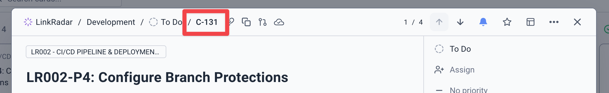
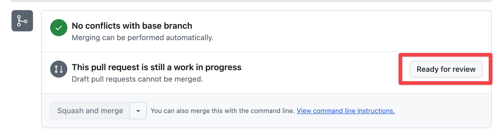
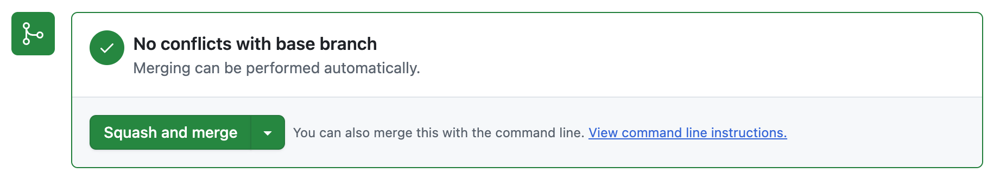
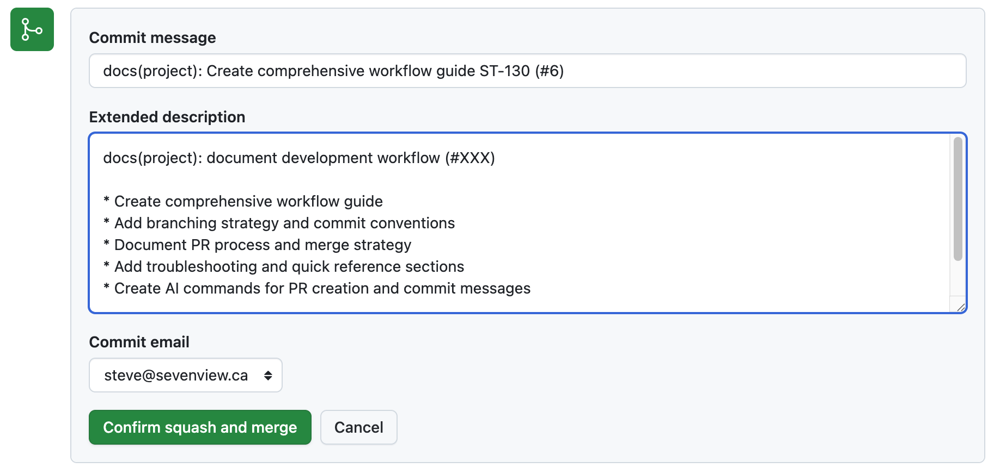
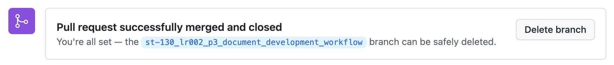

# Git/GitHub Development Workflow

This guide documents how we use Git and GitHub for LinkRadar development. It covers everything from creating branches to merging pull requests, with a focus on clear conventions and smooth collaboration.

## Why This Workflow Matters

This guide documents our Git and GitHub practices—how we branch, commit, create PRs, and merge code. Following these patterns keeps our codebase organized, makes collaboration easier, and enables automated tooling like Superthread integration.

The workflow focuses on:

1. **Clear conventions** - Consistent branch names, commit messages, and labels
2. **Work visibility** - PRs that show what's in progress
3. **Automation** - Superthread integration that tracks card status automatically

Let's walk through how we do this.

## Table of Contents

- [Git/GitHub Development Workflow](#gitgithub-development-workflow)
  - [Why This Workflow Matters](#why-this-workflow-matters)
  - [Table of Contents](#table-of-contents)
  - [Branching Strategy](#branching-strategy)
    - [Master Branch Protection](#master-branch-protection)
    - [Branch Naming Format](#branch-naming-format)
    - [Branch Types](#branch-types)
    - [Working with Superthread Cards](#working-with-superthread-cards)
  - [Commit Conventions](#commit-conventions)
    - [Format](#format)
    - [Scopes](#scopes)
    - [Examples](#examples)
    - [Writing Good Commit Messages](#writing-good-commit-messages)
    - [Commit Frequency](#commit-frequency)
  - [Pull Request Process](#pull-request-process)
    - [The Complete Workflow](#the-complete-workflow)
    - [Benefits of Early Draft PRs](#benefits-of-early-draft-prs)
    - [PR Template](#pr-template)
  - [Labeling](#labeling)
    - [Label Requirements](#label-requirements)
    - [Type Labels](#type-labels)
    - [Area Labels](#area-labels)
    - [Common Combinations](#common-combinations)
  - [Code Review](#code-review)
    - [Before Requesting Review](#before-requesting-review)
    - [Self-Review Checklist](#self-review-checklist)
    - [Addressing Your Own Feedback](#addressing-your-own-feedback)
  - [Merging](#merging)
    - [Why Squash Merge?](#why-squash-merge)
    - [Squash Commit Message Format](#squash-commit-message-format)
    - [Merge Checklist](#merge-checklist)
    - [After Merging](#after-merging)
  - [Troubleshooting](#troubleshooting)
    - [Merge Conflicts](#merge-conflicts)
    - [Wrong Branch Name](#wrong-branch-name)
    - [Creating PR After Work Begins](#creating-pr-after-work-begins)
    - [Work in Progress Commits](#work-in-progress-commits)
  - [Quick Reference](#quick-reference)
    - [Daily Workflow Checklist](#daily-workflow-checklist)
    - [Essential Commands](#essential-commands)
    - [Branch Naming Examples](#branch-naming-examples)
    - [Commit Message Examples](#commit-message-examples)
  - [Conclusion](#conclusion)

## Branching Strategy

Every piece of work starts with a new branch from `master`. This section explains why we use branches, how to name them, and how they integrate with our workflow.

### Master Branch Protection

The `master` branch is always deployable. It's protected, meaning you can't push directly to it—all changes come through pull requests. This keeps master stable and gives you a known-good state to build from.

**Creating a new branch:**
```bash
git checkout master
git pull origin master
git checkout -b feat/add-user-auth
```

### Branch Naming Format

```
{type}/{brief-description}
```

Or, if working on a specific feature epic:
```
{type}/{feature-id}-{brief-description}
```

**Examples:**
- `feat/add-user-authentication`
- `feat/LR002-workflow-automation`
- `fix/resolve-link-validation`
- `docs/create-workflow-guide`
- `chore/update-ruby-version`

**Optional Superthread integration:** You can include the Superthread card ID (`ST-XXX`) in your branch name or PR title to enable automatic card linking. This is helpful but not required—you can also link cards manually in the PR description.

### Branch Types

- **feat/** - New features or functionality
- **fix/** - Bug fixes
- **docs/** - Documentation changes
- **style/** - Code formatting (no logic changes)
- **refactor/** - Code restructuring (no behavior changes)
- **test/** - Adding or modifying tests
- **chore/** - Build tools, dependencies, configurations

### Working with Superthread Cards

Superthread provides a "Copy git branch name" button that suggests names like `st-130_lr002_p3_document_development_workflow`. You can use this if you want automatic card linking, but we prefer cleaner branch names:

**Our preferred approach:**
1. Create a clear branch name: `docs/workflow-guide` or `feat/LR002-workflow-automation`
2. Reference the Superthread card in your PR title or description
3. Link the card manually in the PR if needed

This keeps branch names readable while still connecting work to cards.

**Finding the card ID:**

The card ID is shown in the card header. You can also use the "Copy git branch name" button which includes the ID.



## Commit Conventions

We use Conventional Commits—a standardized format that makes commit history readable and enables automated tooling. Each commit message tells you what changed and where.

### Format

```
<type>(<scope>): <subject>

<body>

<footer>
```

**Type:** Same as branch prefixes (feat, fix, docs, etc.)  
**Scope:** Which part of the codebase (optional but recommended)  
**Subject:** Brief description, imperative mood, no period  
**Body:** Detailed explanation (optional)  
**Footer:** References to issues or cards (optional)

### Scopes

Match your monorepo structure:
- `backend` - Rails API
- `extension` - Browser extension
- `frontend` - Frontend SPA
- `cli` - Command-line tool
- `infrastructure` - Docker, deployment, CI/CD
- `project` - Project documentation

### Examples

**Adding a feature:**
```
feat(backend): add link archival endpoint

Implement POST /api/v1/links/:id/archive endpoint to allow
marking links as archived without deletion. Includes validation
and database migration.
```

**Fixing a bug:**
```
fix(extension): resolve popup not opening on Firefox

The popup.html failed to load on Firefox due to CSP issues.
Updated manifest.json with proper permissions.
```

**Updating dependencies:**
```
chore(infrastructure): update Docker base image to Ruby 3.4.2

Bump base image for security patches and performance improvements.
```

**Simple documentation change:**
```
docs(project): fix typo in workflow guide
```

### Writing Good Commit Messages

**Use imperative mood** - "Add feature" not "Added feature" or "Adds feature"  
**Keep subjects under 50 characters** - Be concise  
**Capitalize the subject** - "Add feature" not "add feature"  
**No period at the end** - Save the character  
**Use the body to explain why** - Not how (code shows how)

### Commit Frequency

Commit after completing logical chunks of work. Small, focused commits are easier to review and understand than large ones. They also make it easier to revert specific changes if needed.

**Example progression:**
```bash
git commit -m "feat(backend): add archival endpoint skeleton"
git commit -m "feat(backend): add archival validation logic"
git commit -m "test(backend): add archival endpoint tests"
git commit -m "docs(backend): document archival API endpoint"
```

Each commit represents a coherent piece of work that can stand on its own.

## Pull Request Process

We create draft PRs early in the development process rather than waiting until work is complete. This approach makes work visible to the team and enables feedback throughout development.

### The Complete Workflow

**1. Start the Superthread card**  
Move it to "In Progress" so the team knows you're working on it.

**2. Create your branch**
```bash
git checkout master
git pull origin master
git checkout -b feat/add-user-auth
```

**3. Create a draft PR**  
When creating your PR early, make an empty commit if you don't have changes ready yet:
```bash
git commit --allow-empty -m "feat(backend): start user authentication work"
git push -u origin feat/add-user-auth
gh pr create --draft --title "feat(backend): Add user authentication ST-128"
```

If you've already started working and have commits, skip the empty commit and create the PR directly.

**4. Add labels**  
Every PR needs two types of labels:
- **Type label:** `type: feat`, `type: fix`, `type: docs`, etc.
- **Area label:** `area: backend`, `area: extension`, etc.

Apply them in the GitHub UI or with:
```bash
gh pr edit --add-label "type: feat" --add-label "area: backend"
```

**5. Link Superthread card (optional)**  
If you include the Superthread card ID (`ST-128`) in your PR title, Superthread will automatically link it. Alternatively, reference the card in your PR description. This enables automatic status updates when the PR merges.

**6. Development work**  
Code, test, commit, and push your changes as you work through the feature.

**7. Mark ready for review**  
When the work is complete, mark the PR as "Ready for review" in GitHub.



**8. Self-review**  
Use GitHub's review feature to review your own code. Look at the diff as if someone else wrote it.

**9. Merge**  
Use squash merge to combine all commits into one clean commit in master.

**10. Clean up**  
Delete the branch after merging (GitHub offers a button for this).

### Benefits of Early Draft PRs

Creating draft PRs early in the development process offers several advantages:

- Work is visible to the team throughout development
- Enables early feedback and course correction
- Superthread card shows PR status and activity
- Continuous integration can run as work progresses

### PR Template

Our PR template (`.github/PULL_REQUEST_TEMPLATE.md`) loads automatically. It includes:

- **Description** - What this PR does and why
- **Related Work** - Link to Superthread card or feature epic
- **Type of Change** - Check the box matching your commit type
- **Required Labels** - Reminder to add type + area labels
- **Testing** - Checklist before marking ready for review
- **Additional Notes** - Screenshots, breaking changes, migration notes

Fill it out as completely as you can when creating the draft. You can always edit it later as the work evolves. If you include a Superthread card link in the PR description, it will be linked to the card.

> **Tip:** See `project/guides/github/pr-template/guide.md` for detailed guidance on filling out the template.

## Labeling

Labels help organize and filter PRs. We use a two-axis system that combines what kind of change (type) with where in the codebase (area).

### Label Requirements

**Every PR must have:**
1. One type label (`type: feat`, `type: fix`, etc.)
2. At least one area label (`area: backend`, `area: extension`, etc.)

Multiple area labels are fine if your change spans modules. For example, a refactor touching both backend and extension gets both `area: backend` and `area: extension`.

### Type Labels

| Label | Use For |
|-------|---------|
| `type: feat` | New features |
| `type: fix` | Bug fixes |
| `type: docs` | Documentation |
| `type: style` | Code formatting |
| `type: refactor` | Code restructuring |
| `type: test` | Test changes |
| `type: chore` | Build, tools, dependencies |

### Area Labels

| Label | Use For |
|-------|---------|
| `area: backend` | Rails API backend |
| `area: extension` | Browser extension |
| `area: frontend` | Frontend SPA |
| `area: cli` | CLI tool |
| `area: infrastructure` | Docker, deployment, CI/CD |
| `area: project` | Project documentation |

### Common Combinations

- `type: feat` + `area: backend` - New API endpoint
- `type: fix` + `area: extension` - Extension bug fix
- `type: docs` + `area: project` - Documentation update
- `type: chore` + `area: infrastructure` - Docker configuration change
- `type: refactor` + `area: backend` + `area: extension` - Cross-cutting refactor

> **Reference:** See `project/guides/github/labels/guide.md` for the complete label taxonomy.

## Code Review

Even when working solo, treat code review as an essential step. Future you needs to understand what past you was thinking.

### Before Requesting Review

- [ ] All tests pass locally
- [ ] No linter errors
- [ ] Code is self-documented or commented where needed
- [ ] PR description is complete and accurate
- [ ] Labels are applied (type + area)
- [ ] You've pushed all commits

### Self-Review Checklist

Use GitHub's review feature to review your own code before merging. Go through the diff file by file and ask:

> **Tip:** Install the [GitHub Pull Requests extension](https://marketplace.visualstudio.com/items?itemName=GitHub.vscode-pull-request-github) to review PR changes directly in VS Code with in-editor commenting and easy navigation between files.

**Code Quality:**
- Is the code doing what it should?
- Are there any obvious bugs or edge cases missed?
- Is it readable? Would someone else understand it?
- Are variable and function names clear?

**Testing:**
- Do the tests cover the important cases?
- Are there edge cases that need tests?
- Do all tests pass?

**Performance:**
- Are there any obvious performance issues?
- Database queries efficient?
- Unnecessary loops or operations?

**Security:**
- Any security implications?
- User input properly validated?
- Secrets properly handled?

**Documentation:**
- Is the code self-explanatory?
- Are complex parts commented?
- Does the PR description explain why?

**Architecture:**
- Does this fit with the overall system design?
- Are you using already established patterns or tooling?
- Are we creating tech debt?
- Would this make sense to someone new?

### Addressing Your Own Feedback

If you find issues during self-review, fix them! Add commits addressing the problems, push them, and review again.

Don't be afraid to catch your own mistakes. That's the point.

## Merging

We use squash merges for all PRs. This means all your individual commits get combined into a single commit when merged to master.

### Why Squash Merge?

**Clean history** - Master shows one commit per PR, not all the "fix typo" commits  
**Easy to understand** - Each commit represents a complete change  
**Simple to revert** - Undo an entire feature with one revert  
**Professional** - History is easy to review and understand  
**Good messages** - You can craft a great commit message at merge time

Your branch keeps all the individual commits for reference. Master gets a clean, linear history.



### Squash Commit Message Format

When you squash merge, GitHub asks for a commit message. Use this format:

```
<type>(<scope>): <description> (#PR-number)

* Key change 1
* Key change 2
* Key change 3

Superthread Card: [URL]
```

**Example:**
```
feat(backend): add link archival endpoint (#42)

* Implement POST /api/v1/links/:id/archive endpoint
* Add database migration for archived_at column
* Include validation and comprehensive tests
* Update API documentation

Superthread Card: https://app.superthread.com...
```



### Merge Checklist

Before clicking that merge button:

- [ ] All CI checks pass (when you have them)
- [ ] PR is marked "Ready for review" (not draft)
- [ ] Self-review is complete
- [ ] Tests pass
- [ ] No linter errors
- [ ] Labels are applied
- [ ] Superthread card is linked

### After Merging

1. **Delete the branch** - GitHub offers a button after merge. Click it.



2. **Check Superthread** - The card should update automatically
3. **Pull master locally** - Get the merged changes: `git checkout master && git pull`

## Troubleshooting

### Merge Conflicts

When your branch conflicts with master (someone else merged changes to the same files):

```bash
# Update your local master
git checkout master
git pull origin master

# Go back to your branch and merge master in
git checkout feat/ST-142-add-link-archival
git merge master

# Git will tell you which files conflict
# Edit those files, look for conflict markers:
# <<<<<<< HEAD
# your changes
# =======
# their changes
# >>>>>>> master

# After fixing conflicts:
git add [fixed-files]
git commit -m "fix: resolve merge conflicts with master"
git push
```

**Tools to help with conflicts:**

**VS Code Merge Editor:** VS Code's built-in merge editor provides a 3-way view (incoming, current, result) that makes it much easier to visualize and resolve conflicts. When you open a conflicted file, VS Code will show options to accept incoming, current, or both changes.

**Cursor AI Resolve Conflicts:** Cursor Agent can help resolve merge conflicts by understanding both sides and proposing a resolution:

1. When a merge conflict occurs, you'll see the conflict markers in your file
2. Click the "Resolve in Chat" button that appears in the merge conflict UI
3. Agent will analyze both versions and suggest a resolution
4. Review the proposed changes and apply them

If you're not sure how to resolve a conflict, ask! Better to pause than to lose someone's work.

### Wrong Branch Name

You created a branch but forgot the card ID or used the wrong type:

```bash
# Rename the local branch
git branch -m old-name new-name

# Delete the old remote branch
git push origin --delete old-name

# Push the new branch name
git push -u origin new-name
```

### Creating PR After Work Begins

If you started working before creating a PR:

```bash
# Push your branch
git push -u origin feat/ST-142-whatever

# Create the PR
gh pr create

# Add labels
gh pr edit --add-label "type: feat" --add-label "area: backend"
```

### Work in Progress Commits

If you need to stop mid-task with uncommitted changes, you can commit work in progress:

```bash
git add .
git commit -m "feat(backend): work in progress on validation logic"
git push
```

Draft PRs accommodate work-in-progress commits.

## Quick Reference

### Daily Workflow Checklist

Starting new work:
- [ ] Pull latest master
- [ ] Create branch: `{type}/{description}` or `{type}/{feature-id}-{description}`
- [ ] Create draft PR (include card ID in title if using Superthread)
- [ ] Add labels (type + area)

During work:
- [ ] Commit logical chunks of work
- [ ] Push changes regularly
- [ ] Strive to commit your work by end of day

Finishing work:
- [ ] Mark PR ready: `gh pr ready`
- [ ] Self-review the diff
- [ ] Merge: `gh pr merge --squash`
- [ ] Delete branch

### Essential Commands

```bash
# Starting work
git checkout master && git pull
git checkout -b feat/add-feature
git commit --allow-empty -m "feat(scope): start feature work"
git push -u origin feat/add-feature
gh pr create --draft --title "feat(scope): Add feature ST-XXX"
gh pr edit --add-label "type: feat" --add-label "area: backend"

# During work
git add .
git commit -m "feat(scope): descriptive message"
git push

# Finishing work
gh pr ready
gh pr merge --squash
git checkout master && git pull
git branch -d feat/add-feature
```

### Branch Naming Examples

| Scenario | Branch Name |
|----------|-------------|
| Add user authentication | `feat/add-user-auth` |
| Feature epic work | `feat/LR002-workflow-automation` |
| Fix extension popup | `fix/firefox-popup` |
| Update documentation | `docs/workflow-guide` |
| Refactor API client | `refactor/api-client` |
| Update dependencies | `chore/update-deps` |
| Add missing tests | `test/link-validation` |

### Commit Message Examples

| Scenario | Commit Message |
|----------|----------------|
| Add new feature | `feat(backend): add link archival endpoint` |
| Fix a bug | `fix(extension): resolve popup sizing on Firefox` |
| Update docs | `docs(project): add Superthread integration guide` |
| Refactor code | `refactor(backend): extract link validation to service` |
| Update deps | `chore(infrastructure): update Ruby to 3.4.2` |
| Add tests | `test(backend): add archival endpoint tests` |

## Conclusion

This workflow establishes consistent patterns for our Git and GitHub usage:

- **Conventional commits** make history readable
- **Consistent branch naming** enables Superthread integration
- **Draft PRs** provide visibility into ongoing work
- **Squash merges** keep master history clean
- **Labels** organize and filter pull requests

These conventions make the codebase easier to navigate and enable automated tooling.

